# OTS Munkajelentő Tracker – Használati útmutató

Verzió: {{VERZIO}} · Mac (macOS 14 vagy újabb)

> **Mi új ebben a verzióban?** Az 1.6.2: MIT licenc, és egy példaszöveg cseréje a skillben (a skill-frissítés jelzése megjelenhet). Az 1.6.1: a javaslatlista javítása (a Munkahely, a Kiindulás és a Cél mezőben a lista az alatta lévő mezők fölött van, és a kattintás elfogadja a javaslatot). Az 1.6.0: az Utazás űrlapon **km-óra** mezők (induló és érkező km, nem kötelezők), **km-javítás** a napi listában, a **hónap összes km-e** az ablak alján (beállítható), és a Költségelszámolás **minden utat külön sorba** teszi, km-ekkel (a skill is így tölti az OTS-t). Az 1.5.6: az **üres szombat és vasárnap is jelez** (hétvégén nincs napi óraszám, bármilyen bejegyzés elég), **Szabadnap egy kattintással** a kitöltetlen napokon, figyelmeztetés a **havi szabadnap-korlátra**, és a skill **már nem egészíti ki a sorokat 8 órára**; az üres vasárnap `!!!` (nem magától szabadnap). Az 1.5.4: a **Beállítások öt fülre** van osztva (Megjelenés, Rögzítés, Naptár, OTS, Adatok), a menüsori ablak bezárása után újranyitáskor a **rögzítő oldal** jön, és a mezők **javaslatokat** adnak gépelés közben (például „ügy” → Ügyintézés). Az 1.5.0: az **Időzítő** korábbi kezdéssel indítható (és futás közben korrigálható), az **Utazás** űrlap újra lett tervezve: **Kiindulás** és **Cél** mező (a Célba több hely is írható, pontos címmel is), a mezők fölött **Munkahely** választógomb, mellettük az **Oda-vissza** pipa (alapból bejelölt). Az 1.4.1: az Utazás **Indulás** és **Érkezés** mezőjébe pontos cím is írható (`Tata, Fő út 1.`), az **Oda-vissza** pipa az Érkezés után az Indulást is felveszi az útvonalba, és az Érkezés mező többé nem szürke (5. és 15.7 pont). Az 1.4.0: **naptárintegráció** – a Mac Naptár-alkalmazásának lezajlott eseményeit (iCloud, Google, Outlook) az alkalmazás bejegyzésként átveszi, egy irányban (15. fejezet); **pontos címek** a bejegyzésekhez és a Google Maps útvonalhoz; az alkalmazáshoz **macOS 14 vagy újabb** kell. Az 1.3.3: a Gemini CLI helyett az **Antigravity CLI** az ingyenes megoldás (a Google leállította a Gemini CLI-t magánszemélyeknek; részletes útmutató a 13. fejezetben és külön PDF-ben). Az 1.3.2: a kategóriák színe újra állítható (beépített színválasztó). Az 1.3.1: *Kézi felvitel az OTS-be* ablak és kategóriaszínek (14. fejezet). Az összes eddigi változás a **17. fejezetben**, a Változásnaplóban van.

> **Röviden:** menüsori időnapló lelkészeknek és gyülekezeti munkatársaknak. Rögzíted, mit csináltál és mennyi ideig, az alkalmazás összesít, figyelmeztet, ha lemaradtál, és ebből tölti ki az MI-asszisztens (Claude, ChatGPT/Codex vagy az ingyenes Antigravity CLI) az OTS Havi munkajelentőjét, a Költségelszámolást és a létszámjelentőt. Minden adat a saját gépeden marad.

## 1. Mire való?

A havi munkajelentőhöz napról napra tudni kell, hogy ki mennyit dolgozott, melyik gyülekezetben, és milyen jellegű munkát végzett. Ezt az alkalmazás menet közben gyűjti:

- **Mérés:** időzítővel, Pomodoróval, utólag kézzel (időponttal vagy óraszámmal), illetve a naptárban kijelölve.
- **Összesítés és figyelmeztetés:** napi összesítő, a napi 8 óra jelzése, kitöltetlen napok, emlékeztető, ha régen nem volt munkajelentő.
- **Gyülekezeti létszámjelentő:** az esedékes szombatokon kéri a számokat, és tárolja őket.
- **Továbbadás:** egy táblázatkezelőben is megnyitható CSV fájl, és az opcionális **skill**, amely az OTS-be viszi az adatokat.

## 2. Telepítés és indítás

1. Bontsd ki a kapott `.zip` fájlt, és húzd az **OTS Munkajelentő Tracker** alkalmazást az **Alkalmazások** mappába.
2. Az első indításnál a Mac figyelmeztethet, hogy az alkalmazás nem ellenőrizhető. Ilyenkor nyisd meg a **Rendszerbeállítások › Adatvédelem és biztonság** oldalt, görgess le, és kattints a **„Mégis megnyitom”** gombra. Ez csak egyszer kell.
3. Az alkalmazás **a menüsorban** jelenik meg (alapból az Adventista jelképpel), nincs Dock-ikonja. Kattints az ikonra, és megnyílik az ablak. **Jobb kattintásra (vagy Ctrl + kattintásra)** menü jön fel, benne a **Kilépés** is.
4. A **Beállításokban** (fogaskerék) bekapcsolhatod az **Indítás bejelentkezéskor** opciót, hogy mindig ott legyen a menüsorban.

## 3. Első lépések (5 perc)

1. **Székhely és helyszínek:** a Beállítások › *Székhely és helyszínek* részben add meg a székhelyed (ez az Utazás alapértéke), és vedd fel azokat a településeket, ahol dolgozol. Később minden új helyszín magától bekerül, amint először használod.
2. **Munkanap:** a Beállítások › *Naptár* részben állítsd be, hogy mikor kezdődik és mikor ér véget a munkanapod (például 6–20), és hogy a hét hétfővel vagy vasárnappal kezdődjön.
3. **Kategóriák:** a Beállítások › *Tevékenység-kategóriák* részben megtekintheted az OTS kategóriáit, elrejthetsz belőlük, és hozzáadhatsz saját kategóriát (például „Önképzés”).
4. **Létszámjelentő (ha neked is kell):** a Beállítások › *Gyülekezeti létszámjelentő* részben kapcsold be, és regisztráld a gyülekezeteidet.
5. **Próba:** válassz egy Munkahelyet, egy Típust, írj egy rövid Tevékenységet, és indítsd el az Időzítőt. Pár másodperc múlva állítsd le és mentsd.

## 4. A főablak

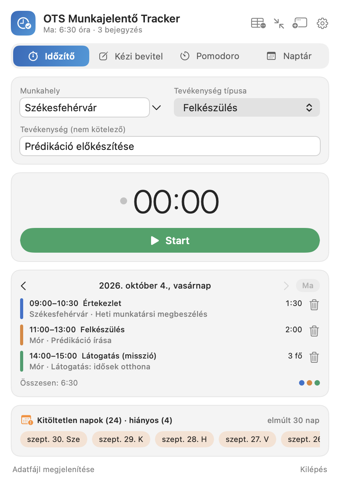

Az ablak tetején a fejléc látható: balra az alkalmazás neve és a **mai összesítés**, jobbra három gomb:

- **Kompakt nézet** (két nyíl): kisebb, keskenyebb ablak. Kis kijelzőn automatikusan ez van érvényben.
- **Kézi felvitel** (táblázat ikon): külön ablak az OTS-be kézzel történő felvitelhez (lásd a 14. fejezetet).
- **Leválasztás** (ablak ikon): külön, mozgatható ablakot nyit (lásd a 9. fejezetet).
- **Beállítások** (fogaskerék).

Alatta négy **lap** van: **Időzítő**, **Kézi bevitel**, **Pomodoro**, **Naptár**. A lapfül teljes területére kattinthatsz, nem csak a szövegre.

Az alsó részen a kiválasztott nap bejegyzései (napi lista), az esedékes létszámjelentő és a **kitöltetlen napok** látszanak. Ha régen nem írtál munkajelentőt, a fejléc alatt egy **piros emlékeztető sáv** jelenik meg (lásd a 9. fejezetet).

## 5. Mit kell megadni egy bejegyzéshez?

Mindhárom rögzítési módban (Időzítő, Kézi bevitel, Pomodoro, valamint a Naptárban az új idősávhoz) ugyanazok a mezők vannak:

| Mező | Mit írj bele |
|---|---|
| **Munkahely** | A település, ahol dolgoztál. A nyíllal a mentett helyszínekből választhatsz. Kötelező. |
| **Tevékenység típusa** | Legördülő lista, az OTS Havi munkajelentő oszlopai szerint (lásd lent). Kötelező. |
| **Mennyiség** | Csak a Látogatás típusoknál (**fő**) és az Istentisztelet, Evangelizáció, Bibliaóra típusoknál (**alkalom**) jelenik meg. A szám után áll a mértékegység. |
| **Tevékenység** | Rövid leírás arról, mit csináltál. **Csak az Utazásnál kötelező**, mert a Költségelszámolás „Tevékenység” oszlopát kizárólag az Utazás bejegyzések Tevékenységéből tölti ki az asszisztens (más kategória szövegét nem veszi át). Minden másnál opcionális, csak referencia neked. |

**Rögzítés után az űrlap kiürül**, így nem kell kitörölnöd a következő bejegyzés előtt.

**Javaslatok gépelés közben.** A Munkahely, a Kiindulás, a Cél, a Tevékenység típusa és a Tevékenység mezőben gépelés közben a mező alatt javaslatok jelennek meg (a mentett helyszínekből, a típusokból és a korábbi tevékenységekből), ékezet- és kisbetű-függetlenül: az „ügy” és az „ugy” is az Ügyintézés-t adja. **↓ és ↑** lépked a javaslatok között, **Enter** vagy **Tab** elfogadja, **Esc** bezárja; kattintással is választhatsz. A Cél mezőben (több hely) az éppen írt helyre ad javaslatot, cím (utca, házszám) közben nem. A Tevékenység típusa mezőnél a nyíl a teljes csoportosított listát nyitja. Ha nem szeretnéd, a **Beállítások › Rögzítés** alatt kikapcsolható (a típus mező ilyenkor a régi legördülő lista).

### Utazás: Kiindulás és Cél

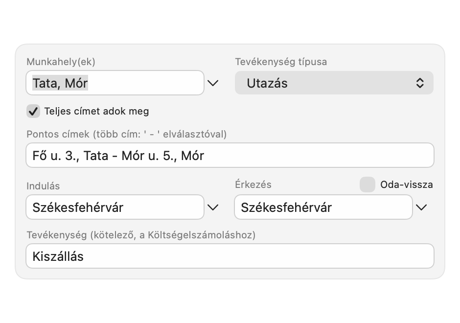

Az **Utazás** típusnál a Munkahely mező helyett két mező van:

- **Kiindulás:** honnan indultál (alapból a székhelyed). Egy hely: település (`Győr`) vagy település és pontos cím (`Győr, Fő út 1.`, a település elöl, vesszővel).
- **Cél:** hová mentél. **Több helyet is megadhatsz**, sorrendben, vesszővel elválasztva (`Tata, Mór`), és bármelyik lehet pontos címmel (`Tata, Fő út 1., Mór`). A vesszők közt az utcára vagy házszámra utaló rész (például `Fő út 1.`, `Kossuth u.`) a megelőző településhez tartozó cím, minden más rész új település. Ha kétséges, a helyeket ` - ` vagy `;` is elválasztja (`Tata - Mór u. 5., Mór`).
- **Munkahely** választógomb a két mező fölött: azt jelöli, hogy a **Kiindulás** vagy a **Cél** volt a munkahely. Alapból a Cél. Az OTS Havi munkajelentő Munkahely mezőjébe ez kerül.
- **Oda-vissza** pipa a két mező mellett. **Alapból be van jelölve**: a munka után visszatértél a Kiindulásra, így az útvonal `Kiindulás - Cél(ek) - Kiindulás`, és a Google Maps a teljes oda-vissza távolságot számolja. Ha **kikapcsolod**, az út egyirányú volt: `Kiindulás - Cél(ek)`. A pipa minden rögzítés után újra bejelölt.

- **Km-óra** (induló és érkező km): az Utazás űrlap alján mindig látszik két mező, **egyik sem kötelező**. Az induló km **az előző út végállásával előtöltődik**, az érkezőt az út végén írhatod be (üresen is hagyhatod). Az érkező km legyen nagyobb az induló km-nél, az induló pedig ne legyen kisebb az előző út végállásánál; hibás értéknél az űrlap jelzi, és nem engedi a rögzítést. Oda-vissza útnál az állások az egész körútra vonatkoznak.

Az **Utazásnál a Tevékenység kötelező** (az Út célja), mert ez kerül a Költségelszámolás táblázatba. Az OTS-be mindig a **település** kerül, a pontos címet a Google Maps használja.

### A típusok

| Típus | Egység | Megjegyzés |
|---|---|---|
| Istentisztelet, Evangelizáció, Bibliaóra | alkalom | A Mennyiség mezőben add meg, hány alkalom volt. |
| Látogatás (gyülekezet), Látogatás (misszió) | fő | A Mennyiség a meglátogatottak száma. |
| Ügyintézés, Értekezlet, Adminisztráció, Felkészülés, Utazás, Továbbképzés (résztvevő / tartott) | óra | Az eltelt idő számít. |
| Szabadság, Szabadnap, Munkaszüneti nap | egész nap | Csak a Kézi bevitelnél vehető fel, időtartam nélkül. Kitöltött napnak számítanak. |
| Saját kategóriák | óra, alkalom vagy fő | Személyes használatra, **az OTS-be nem kerülnek át**. |

## 6. Rögzítési módok

### 6.1. Időzítő

Töltsd ki a mezőket, és kattints a **Start** gombra. Az idő a menüsori ikon mellett is látszik. **Ha már régebben dolgozol, és csak most jutott eszedbe elindítani**, indítás előtt állítsd be a **Kezdés** idejét (óó:pp), vagy kattints a **−5, −10, −15, −30** gombok egyikére (ennyi perccel korábbi kezdés); a **Most** gomb visszaállítja a mostani indulást. Az idő ettől a kezdéstől számolódik. Futás közben is javítható a Kezdés (legfeljebb a nap elejéig, és nem lehet jövőbeli).

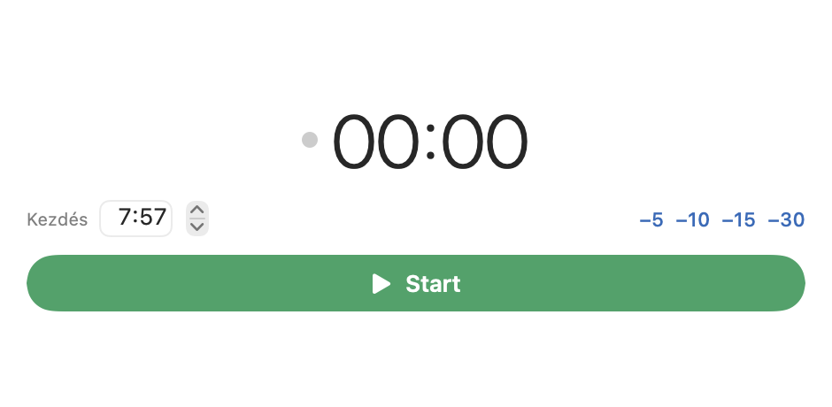

 A **Stop és mentés** gomb elmenti a bejegyzést, az **Elvetés** nem ment semmit. Ha kilépsz az alkalmazásból, miközben az időzítő fut, a kezdési idő megmarad, és az indulás után folytatódik.

### 6.2. Kézi bevitel

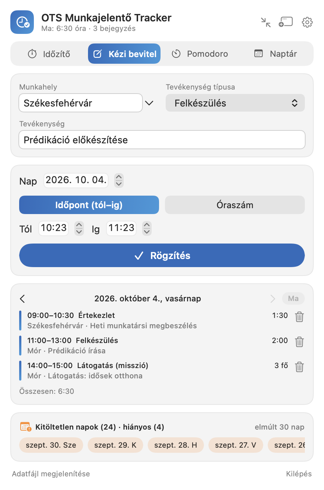

Utólagos rögzítéshez. Válaszd ki a **napot** (jövőbeli nap nem választható), majd:

- **Időpont (tól–ig):** add meg a kezdést és a végét, vagy
- **Óraszám:** add meg az órát és a percet (5 perces lépésekkel).

A két lehetőség egymás mellett van, az egyiket választod. Az alkalom és fő típusoknál időtartam nem kell, csak a mennyiség. A **Szabadság, Szabadnap, Munkaszüneti nap** típusoknál csak a napot adod meg. Ugyanarra a napra ugyanabból a nem munkaidős típusból csak egy vehető fel. A mai napon a jövőbeli időpont sem rögzíthető.

### 6.3. Pomodoro

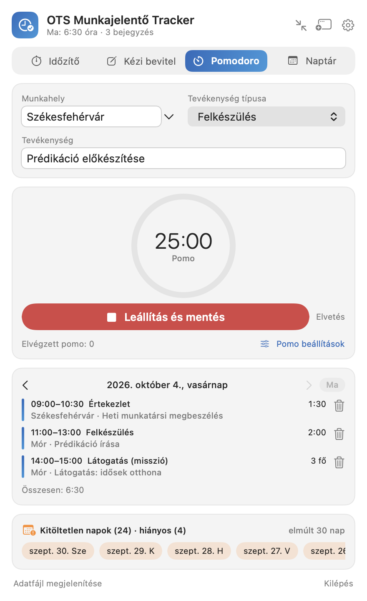

A Pomodoro-technika: rövid, koncentrált munkaszakaszok (**pomók**) szünetekkel. Az alapbeállítás: **25 perc pomo, 5 perc rövid szünet, minden 4. pomo után 15 perc hosszú szünet**.

- **Pomo indítása:** kitöltött mezők után indul. A menüsorban a pomo ideje látszik (alapból egy paradicsom ikon mellett, szünetben egy csészével).
- **Leállítás és mentés:** a félbehagyott pomo **eltelt ideje is bekerül** a naplóba. A 30 másodpercnél rövidebb időt az alkalmazás véletlen kattintásnak veszi, és nem menti.
- **Elvetés:** semmit nem ment.
- **Szünet kihagyása:** a szünet helyett azonnal várakozó állapotba lépsz.
- Egy pomo végén az alkalmazás **hangot ad és értesítést küld**. A hang a Beállításokban választható.

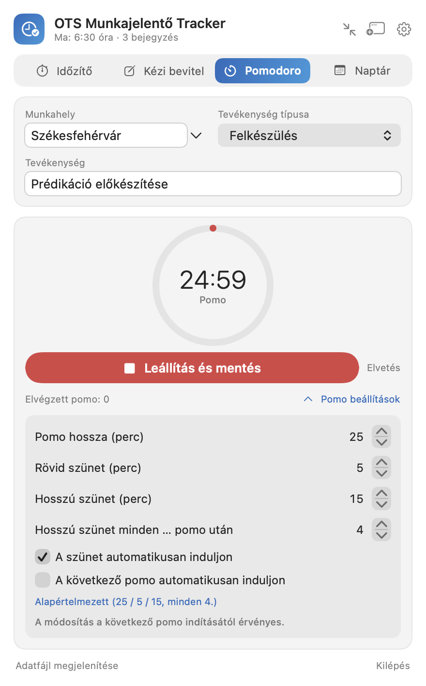

A **Pomo beállítások** a Pomodoro lapon nyílnak le: a pomo és a szünetek hossza, hány pomo után jön a hosszú szünet, valamint hogy a szünet, illetve a következő pomo automatikusan induljon-e. Az **Alapértelmezett** gomb visszaállítja a 25 / 5 / 15 percet.

### 6.4. Naptár

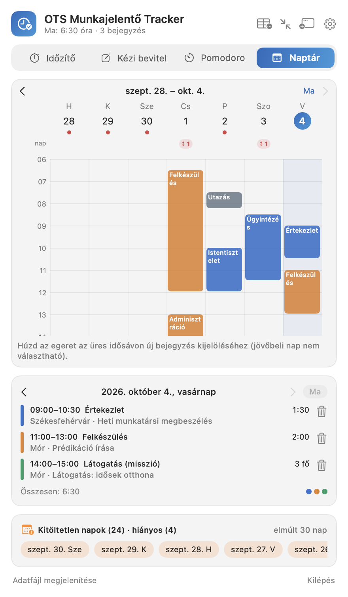

Heti nézet. A hét **hétfővel vagy vasárnappal** kezdődik, ahogy a Beállításokban megadod. A rögzített bejegyzések színes idősávokként látszanak, a típus csoportja szerint. Az idő nélküli bejegyzések (óraszám, alkalom, fő, egész nap) a nap tetején kis címkeként jelennek meg.

- A naptár **csak a beállított munkanapot** mutatja (a képen 6:00 és 19:00 között). Ha egy bejegyzés kilóg ebből a sávból, a nap tetején egy piros **↕ jel** mutatja, hány ilyen van. Ezek a napi listában mindig látszanak.
- A nap neve alatti **piros pont** azt jelzi, hogy azon a napon még nincs meg a napi 8 óra (lásd a 7. fejezetet).

**Új bejegyzés a naptárból:**

1. Az üres részen **kattints és húzd az egeret** az időtartam felett (15 perces lépésekkel). A kijelölés szaggatott keretes sávként látszik.
2. Megjelenik az űrlap: add meg a Munkahelyet, a Típust és a Tevékenységet.
3. Kattints a **Rögzítés** gombra (vagy a **Mégse** gombra).

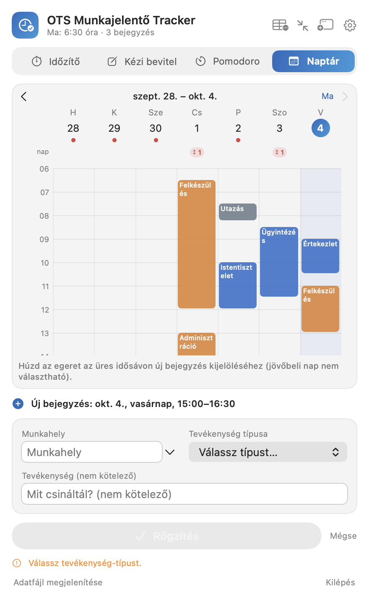

A nap fejlécére vagy egy idősávra kattintva kiválasztod a napot, és az alsó lista azt mutatja. A **Ma** gomb visszaugrik az aktuális hétre. **Jövőbeli napra vagy a mai nap jövőbeli idejére nem lehet bejegyzést felvenni**, ezek halványak.

## 7. Napi lista, napi 8 óra és kitöltetlen napok

A főablak alján a **kiválasztott nap** bejegyzései állnak: idő, típus, munkahely, tevékenység és mennyiség (utazásnál az útvonal: Indulás → Munkahely(ek) → Érkezés). A nyilakkal lapozhatsz a napok között (a jövőbe nem), a **Ma** gomb a mai napra ugrik. Egy bejegyzés törléséhez kattints a kuka ikonra, majd a **Biztos?** feliratra.

**Összesen és a napi 8 óra:** az OTS-be kerülő idő összege. Az óra típusoknál az eltelt idő számít, a **fő és az alkalom is darabonként 1 órának számít**, az egész napos típusok nullának, a saját kategóriák pedig nem számítanak bele.

- Hétfőtől péntekig **8 óra** az elvárás (a Beállításokban módosítható). Ha egy napon még nincs meg, egy **piros pont** és az állás (például *Összesen: 5:30 / 8:00*) mutatja a napi listában, a naptár nap-fejlécében és a kitöltetlen napok között.
- A mai napon a jel **narancs**, mert a nap még folyamatban van. Ha megvan a 8 óra, zöld pipa jelenik meg.
- **Szombaton és vasárnap nincs napi óraszám:** bármilyen bejegyzés elég (akár egyetlen Istentisztelet is). **Üres szombat vagy vasárnap viszont jelez** (piros pont, és a kitöltetlen napok között szerepel), mert a vasárnap sem „magától szabadnap”: lehet, hogy aznap más tevékenység volt. A szabadnapot **Szabadnap** bejegyzés jelöli.
- Mentes az elvárás alól a jövő, és minden nap, amelyen van **Szabadság, Szabadnap vagy Munkaszüneti nap** bejegyzés.

**Kitöltetlen napok:** az ablak alján narancssárga címkék mutatják azokat a napokat, amelyekhez még nincs bejegyzés (a vasárnapot is beleértve, a mai napot nem). Mellettük **piros pontos címkék** jelzik a *hiányos* napokat (van bejegyzés, de nincs meg a 8 óra), és lila címkék az esedékes, még üres *létszámjelentőket*. Egy címkére kattintva az adott napra ugrasz, és felvihetsz adatot.

**Szabadnap egy kattintással:** a kitöltetlen napok narancs címkéjén a **hold ikon** (vagy jobb kattintásra a *Szabadnapnak jelölöm*) egy kattintással felveszi a Szabadnap bejegyzést arra a napra. A sor címében a **Vasárnapok → szabadnap (N)** gomb az összes kitöltetlen vasárnapot egyszerre jelöli meg (a kiválasztott időszakon belül). Csak üres, múltbeli napot jelöl. Az OTS **havonta legfeljebb annyi SZABADNAP-ot** (és külön annyi MUNKASZÜNETI NAP-ot) enged, ahány hétből áll a hónap (28 nap = 4, 29–31 nap = 5); ha egy jelöléssel átlépnéd, az alkalmazás **figyelmeztet** (a rögzítést nem akadályozza), mert a skill a hónap lezárása előtt ezt hibának veszi. Az ellenőrzött időszakot a Beállításokban állítod: 7 nap, 2 hét, 30 nap, előző hónap eleje, e hónap eleje (alapból).

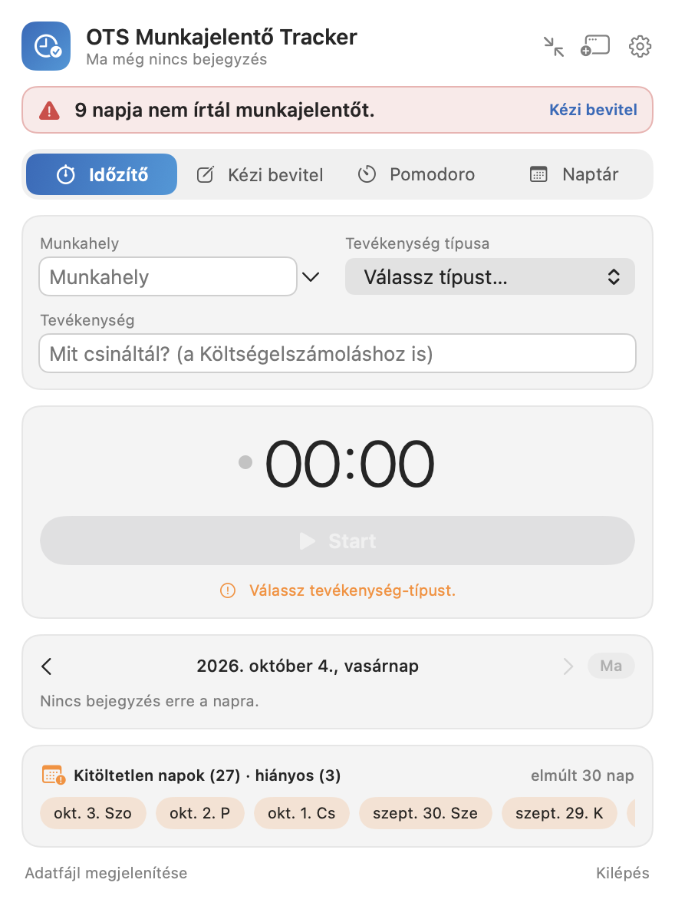

**Km-állások javítása:** az Utazás sorokon **ceruza ikon** van. Rákattintva a sor alatt kinyílik az induló és az érkező km, **Mentés** gombbal véglegesíted. Ugyanazok az ellenőrzések érvényesek, mint rögzítéskor (az érkező nagyobb az induló km-nél, az induló nem kisebb az előző út végállásánál); üresen hagyva az érték törlődik. A sorban a *km-óra: 1000 → 1060 (60 km)* látszik.

**A hónap összes km-e:** a *Beállítások › Rögzítés › Kilométeróra* alatt bekapcsolhatod a **„Minden úthoz megadom a km-órát is”** kapcsolót. Ilyenkor az ablak alján látszik a kiválasztott nap hónapjának autós km-e (például *2026. október: 1234 km*); csak a két állással rögzített utak számítanak, és a sor jelzi, ha valamelyik útnál hiányzik valamelyik állás.

## 8. Gyülekezeti létszámjelentő

A Beállítások › *Gyülekezeti létszámjelentő* résznél kapcsolhatod be, és itt regisztrálhatod a **gyülekezeteidet** (sorrendben). Esedékes minden negyedév **második és hetedik szombatja** (például 2026-ban: július 11. és augusztus 15., október 10. és november 14.).

- Az esedékes szombaton a napi lista alatt megjelenik a **Gyülekezeti létszámjelentő** kártya, amelyen gyülekezetenként a **Szombatiskola** és az **Istentisztelet** három-három számát adod meg: *gyermek*, *felnőtt adventista* és *felnőtt vendég*. A **Mentés** gomb elmenti az összes gyülekezetét.
- Ha az esedékes napon nem töltötted ki, utólag lila címkeként szerepel a kitöltetlen napok között. A címkére kattintva a kártya megnyílik az adott dátumra.
- Mentés után a napi listában a gyülekezet neve mellett egy sor mutatja a rögzített számokat, és a kártyán *Mentve* felirat látszik. Bármikor módosíthatod („Frissítés”).
- A számok a bejegyzések mellett egy külön, táblázatkezelőben is megnyitható fájlba kerülnek (`letszamjelentesek.csv`). A skill a Látogatottság feladatnál innen olvassa ki őket.

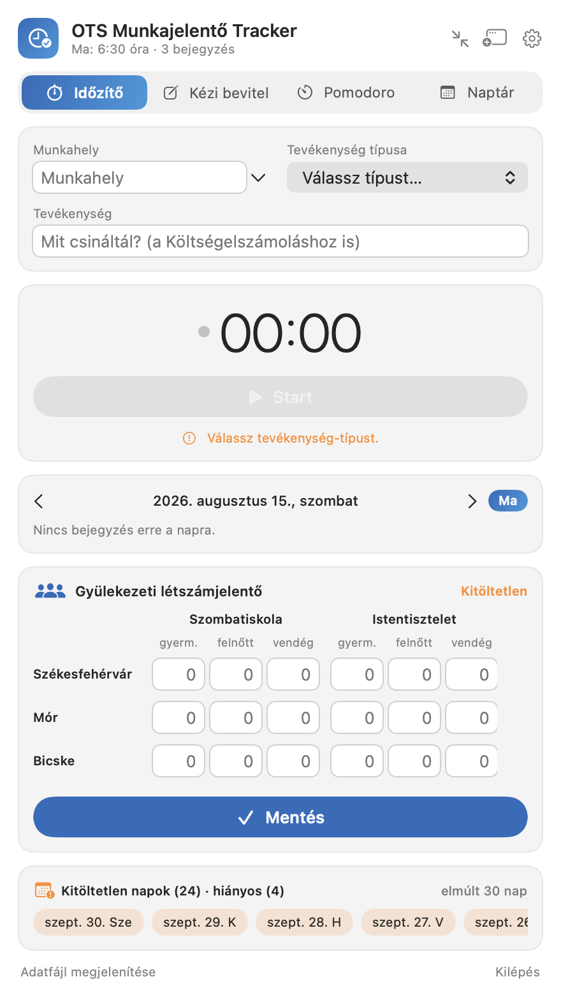

## 9. Menüikon, jobb kattintás, külön ablak, kompakt nézet

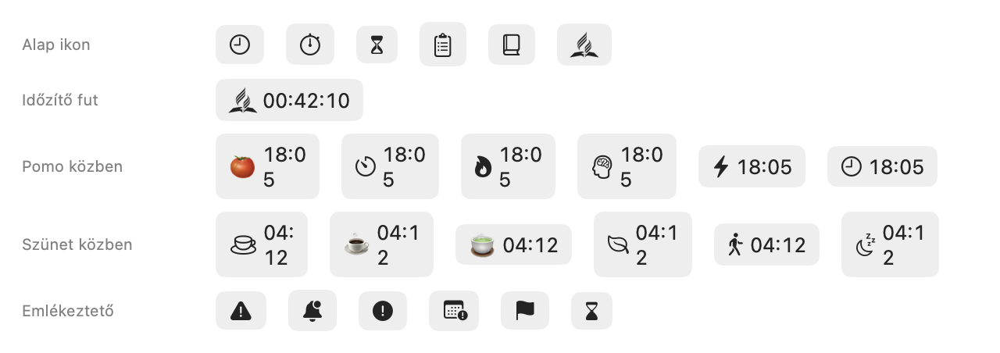

**Ikonok:** a Beállítások › *Menüsori ikonok* részben hat ikon közül választhatsz az alapállapothoz (alapból az Adventista jelkép), és külön ikont az alábbiakhoz is: **pomo közben** (alapból 🍅), **szünet közben** (alapból csésze) és **hosszú kihagyás után** (alapból figyelmeztető háromszög). A kapcsolóval eldöntheted, hogy a hátralévő idő látszik-e az ikon mellett pomo és szünet közben.

**Emlékeztető:** a Beállítások › *Emlékeztetők és jelzések* részben megadhatod, hány egymást követő kitöltetlen nap után (alapból 7) változzon az ikon a figyelmeztető ikonra, és jelenjen meg az emlékeztető sáv („9 napja nem írtál munkajelentőt”). A szabadság, szabadnap és munkaszüneti nap bejegyzés kitöltött napnak számít, így egy szabadság nem vált ki riasztást. Az ikon visszaáll, amint rögzítesz egy új bejegyzést.

**Jobb kattintás (vagy Ctrl + kattintás) az ikonra** menüt ad:

- Ablak megnyitása
- Futó időzítő vagy pomo leállítása és mentése, elvetése (szünetben a kihagyás)
- Leválasztás külön ablakba (vagy a leválasztott ablak előrehozása és bezárása)
- Kompakt nézet
- Menüsori ikon választása
- Adatfájl megjelenítése a Finderben
- **Kilépés**

**Leválasztott ablak:** a fejléc ablak ikonja külön, mozgatható ablakot nyit, amit bárhová húzhatsz. A kitűző gombbal (*pin*) kapcsolhatod, hogy mindig legfelül maradjon-e. A pozícióját megjegyzi. **Átméretezhető:** az ablak szélét vagy sarkát húzva szélesebb és magasabb is lehet (szélesség alapból 440, kompaktban 340 ponttól, legfeljebb 900 pontig): a tartalom kitölti a szélességet, a naptár rácsa szélesedik, magasabb ablakban több óra látszik. A kompakt/normál nézet váltása a szélességet az adott nézet alapméretére állítja vissza. (A menüikonra kattintva nyíló lenyíló ablak mérete nem módosítható; ha nagyobb felületet szeretnél, használd a leválasztott ablakot.) Ha van leválasztott ablak, a menüikonra kattintva az jön előre.

**Kompakt nézet:** keskenyebb ablak, ikonos fülek, kevesebb felirat. A fejlécben, illetve a jobb kattintás menüben kapcsolható. **Alacsony kijelzőn** (880 pontnál kisebb látható magasságnál, például kisebb MacBookon) az ablak magától kompakt, hogy beférjen a képernyőre; ilyenkor az esedékes létszámjelentő űrlapja elrejti a napi listát és a kitöltetlen napokat, amíg ki nem töltöd.

## 10. Megjelenés: színséma, világos és sötét mód

A Beállítások › *Megjelenés* részben:

- **Világos**, **Sötét** vagy **Rendszer** (a Mac beállítását követi, ez az alap). A választás az alkalmazás összes ablakára érvényes.
- **Színséma:** négy közül választhatsz: *Kék* (alap), *Zöld*, *Lila*, *Borostyán*. A séma a kiemelő színt cseréli (fejléc, aktív lap, gombok). A jelentésű színek nem változnak: zöld = indítás/rendben, piros = leállítás/hiány, narancs = figyelmeztetés.

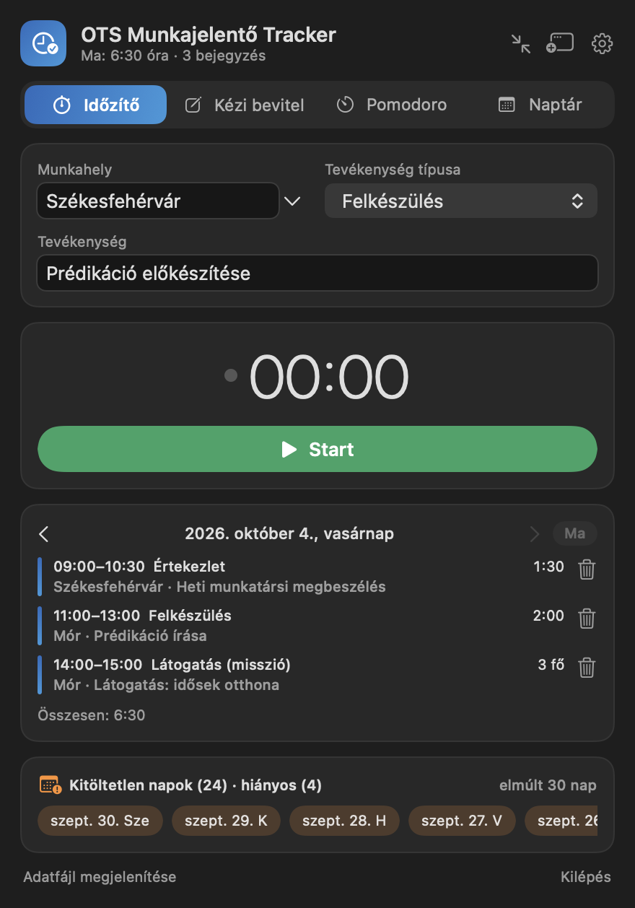
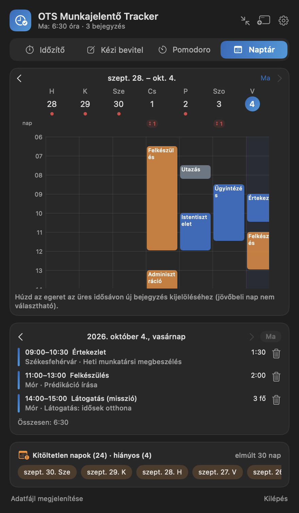

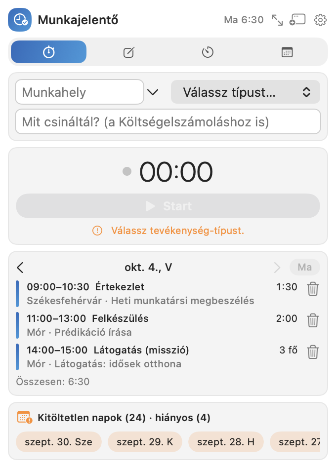
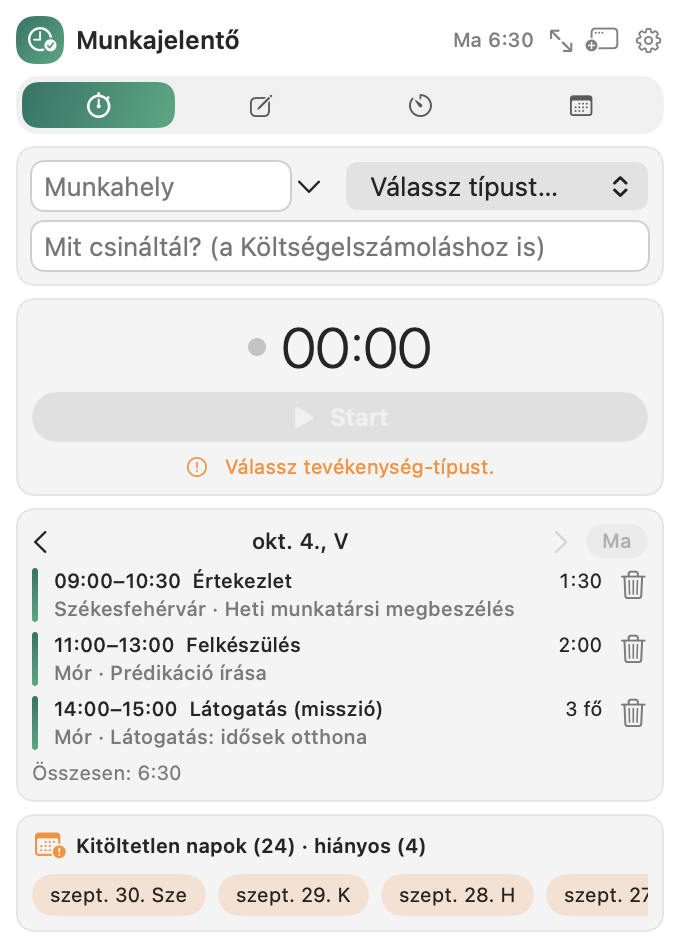
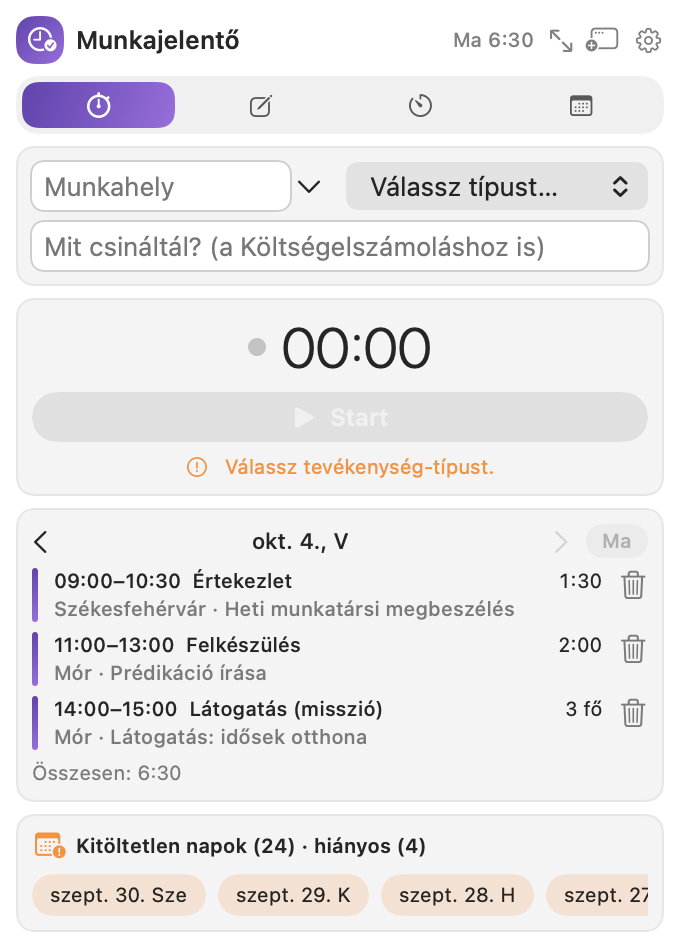
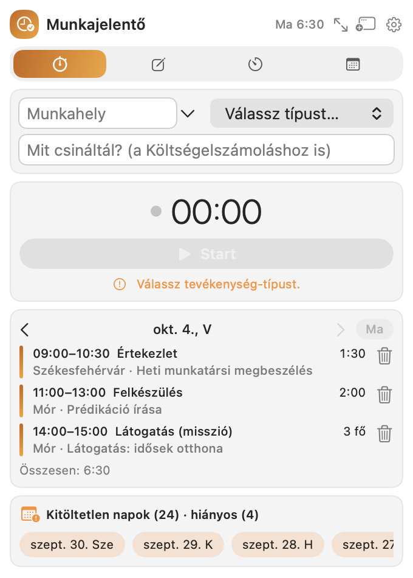

## 11. Beállítások

A Beállítások (fogaskerék) **öt fülre** van osztva, a lap tetején: **Megjelenés**, **Rögzítés**, **Naptár** (a Mac Naptár szinkronja), **OTS** és **Adatok**. Az utoljára megnyitott fül megmarad. Ha a menüsori ablakot bezárod (az ikonra vagy az ablakon kívülre kattintva), **újranyitáskor a rögzítő oldal** jön, nem a Beállítások. Az alábbi képek az összes kategóriát egymás alatt mutatják.

- **Megjelenés:** színséma, világos/sötét mód, menüsori ikonok, jelzőhangok.
- **Rögzítés:** székhely és helyszínek, kategóriák és színek, javaslatok gépelés közben, a kilométeróra kapcsoló, a Naptár fül munkanap-sávja és a hét kezdőnapja, emlékeztetők és jelzések.
- **Naptár:** a Mac Naptár szinkronja (15. fejezet).
- **OTS:** gyülekezeti létszámjelentő, skill és kézi felvitel.
- **Adatok:** adatfájl, indítás bejelentkezéskor, útmutató, törlés (alapállapot).

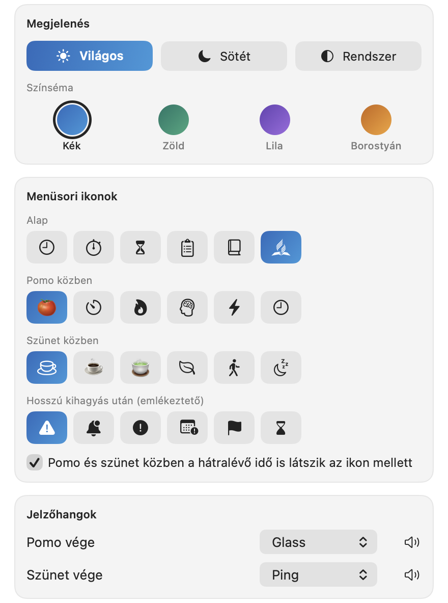

- **Megjelenés:** világos/sötét/rendszer mód és a színséma.
- **Menüsori ikonok:** alap, pomo, szünet és emlékeztető ikon, hátralévő idő a menüsorban.
- **Jelzőhangok:** a pomo és a szünet végének hangja (14 rendszerhang, vagy hang nélkül), meghallgatható.
- **Naptár:** a munkanap kezdete és vége, a hét kezdőnapja.
- **Naptár-szinkron (Mac Naptár):** a naptárintegráció be- és kikapcsolása, az engedély, a naptárak kiválasztása, a követett időszak, a „Szinkron most” gomb, az „Átnézésre vár” és a „Jelölések” ablak (lásd a 15. fejezetet).
- **Emlékeztetők és jelzések:** a kitöltetlen napok ellenőrzésének időszaka, a hosszú kihagyás jelzése (be/ki, hány nap után), a napi elvárt óraszám.

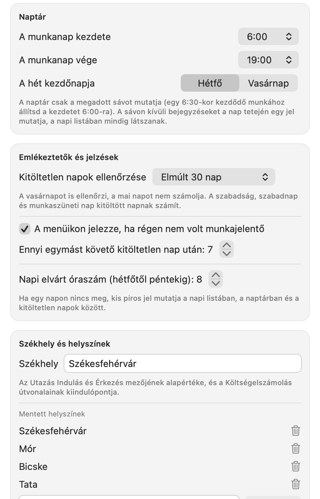

- **Székhely és helyszínek:** a székhely, valamint a mentett helyszínek listája (hozzáadás, törlés). A törlés a már rögzített bejegyzéseket nem érinti.

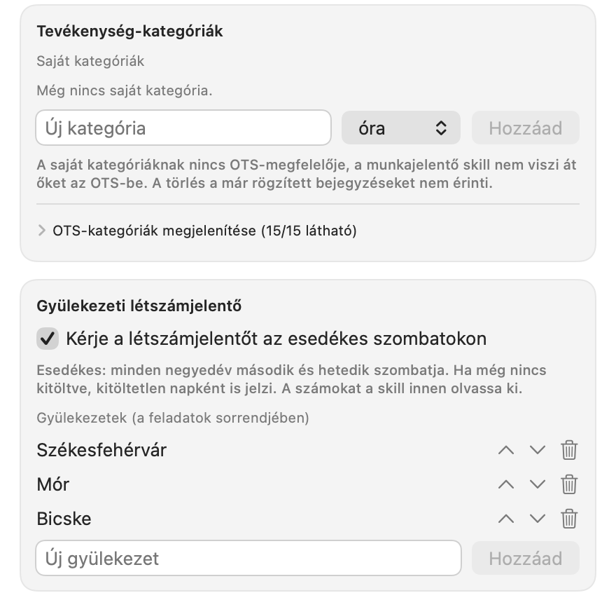

- **Tevékenység-kategóriák:** saját kategóriák hozzáadása, átnevezése, törlése, a kategóriák színei, és a beépített OTS-kategóriák elrejtése.
- **Gyülekezeti létszámjelentő:** be/ki kapcsoló és a gyülekezetek listája (sorrend módosítható).
- **Adatfájl:** az adatfájl helye és módosítása.

- **Skill:** a telepítő varázsló (lásd a 13. fejezetet).
- **Indítás bejelentkezéskor**, a **Használati útmutató** megnyitása és a verzió.
- **Adatok törlése, alapállapot** (lásd a 12. fejezetet).

## 12. Adatok, biztonság, törlés

**Hol vannak az adataim?** Egy mappában a gépeden:

`~/Library/Application Support/OTS Munkajelentő Tracker/`

- `bejegyzesek.csv`: a bejegyzések.
- `letszamjelentesek.csv`: a gyülekezeti létszámjelentések.

A **Beállítások › Adatfájl** részben másik mappát is kijelölhetsz (például egy szinkronizált mappát). A főablak alján az **Adatfájl megjelenítése** gomb megmutatja a Finderben. Az adatok sehova nem kerülnek az internetre.

**Szerkesztés táblázatkezelőben:** a fájlok pontosvesszővel tagolt, UTF-8 kódolású CSV-k. Megnyithatod őket Excelben, Numbersben vagy LibreOffice-ban, javíthatsz sorokat, és az alkalmazás a következő megnyitáskor újra beolvassa. A `bejegyzesek.csv` fontos oszlopai:

| Oszlop | Jelentés |
|---|---|
| Dátum | A bejegyzés napja (ÉÉÉÉ-HH-NN). |
| Kezdés, Vége | Időpontok (óó:pp:mm). Ha mindkettő ki van töltve, ebből számolódik az időtartam. |
| Időtartam (mp) | Időtartam másodpercben, ha nincs kezdés és vég. |
| Indulás, Munkahely, Érkezés | Utazásnál mindhárom (oda-vissza útnál az Érkezés az Indulással egyezik meg; egyirányú útnál az Érkezés a Cél utolsó helye; a Munkahely oszlop a Cél helyei); más típusnál csak a Munkahely. A Munkahely(ek) vesszővel elválasztott lista. |
| Típus kód, Típus | A kategória kódja és neve. A kódot ne írd át, ha nem kell. |
| Mennyiség | Alkalom vagy fő. |
| Tevékenység | Szabad szöveg. |
| Forrás | Honnan jött a bejegyzés: `timer`, `pomodoro`, `manual` vagy `calendar` (az alkalmazás Naptár nézetében húzással felvett, vagy a Mac Naptárból átvett; az utóbbit a Naptár azonosító oszlop különbözteti meg). |
| Cím | Opcionális. A pontos cím(ek) ` - ` (szóköz-kötőjel-szóköz) elválasztóval. A Munkahely oszlop település marad. |
| Munkahely helye | Utazásnál: `indulás`, ha a Kiindulás volt a munkahely (az OTS Munkahely mezőjébe ilyenkor az Indulás kerül, a `Munkahely` oszlop pedig az útvonal köztes helyeit adja). Üres: a Cél helyei a munkahelyek. |
| Indulás cím, Érkezés cím | Utazásnál az Indulás és az Érkezés pontos címe, ha megadtad (`Fő út 1., Tata` alakban: utca elöl, település a végén). Az Indulás és az Érkezés oszlop település marad. |
| Naptár azonosító | A naptárból átvett bejegyzésnél az esemény azonosítója (+ a nap); ez alapján követi az alkalmazás a naptárat. Ne írd át. |

A régi fájlok (a `Cím` és a `Naptár azonosító` oszlop nélkül) változtatás nélkül olvashatók. A naptár-szinkron minden módosítás előtt másolatot készít: `bejegyzesek.naptar-elotti.csv` (a következő szinkron felülírja).

Ha egy fájl hibás sort tartalmaz, az alkalmazás figyelmeztet, a hibás sorokat kihagyja, és **mentés előtt másolatot készít a fájlról** (`bejegyzesek.hibas-….csv`), hogy semmi ne vesszen el.

**Az összes adat törlése (alapállapot):** *Beállítások › Adatok törlése, alapállapot*. A rész alapból összecsukott. Az „Összes adat törlése…” gomb **két külön megerősítést** kér, és mindkettőn a „Mégse” az alapértelmezett (az Enter a biztonságos választ adja). Törlődik minden bejegyzés, a létszámjelentések, a mentett helyszínek (a lista üres lesz, és rögzítéskor újra felépül) és a saját kategóriák. A beállítások (ikonok, hangok, nézet, színséma) megmaradnak. **Biztonsági okból a törlés előtti állapot egy másolata megmarad** (`bejegyzesek.torles-elotti.csv`, `letszamjelentesek.torles-elotti.csv`) ugyanabban a mappában. Ezeket a következő törlés felülírja. Ha végleg el akarod tüntetni az adatot, ezeket is töröld kézzel.

## 13. Skill: automatikus kitöltés az OTS-ben („OTS Adminisztráció”)

A **skill** (neve: **OTS Adminisztráció**, azonosítója `ots-adminisztracio`) egy leírás, amely megtanítja az MI-asszisztenst az OTS adminisztrációs feladataira: **Havi munkajelentő**, **Költségelszámolás**, Gyülekezeti névsor, Hittan, Gyülekezeti látogatottság. A munkajelentőhöz, a költségelszámoláshoz és a létszámjelentőhöz ennek az alkalmazásnak az adatait használja.

**Mire van szükség?** A Claude asztali alkalmazására (Mac, fizetős előfizetéssel), annak **Code** lapjára és a beépített böngészőre (ezt teszteltük). **Ingyenes megoldásként két másik asszisztens is kipróbálva:** a **ChatGPT Codex** (a ChatGPT asztali alkalmazás és a Codex ugyanazt a skillmappát használja) és az **Antigravity CLI** (`agy`, személyes Google-fiókkal, heti kerettel). Mindkettő látja és olvassa az OTS-t, és kattint rajta. A telepítő mindkettő mellett „Ingyenes” jelzést mutat. Az Antigravity CLI telepítését a külön *Antigravity CLI útmutató* írja le (PDF, és a telepítő utolsó lépéséből is megnyitható). A korábbi Gemini CLI magánszemélyeknek 2026. június 18-tól nem használható. Az OTS-be te jelentkezel be, a jelszavadat az asszisztens soha nem írja be.

**Telepítés:** *Beállítások › Skill › Skill telepítése…*. A varázsló hat lépésen vezet végig:

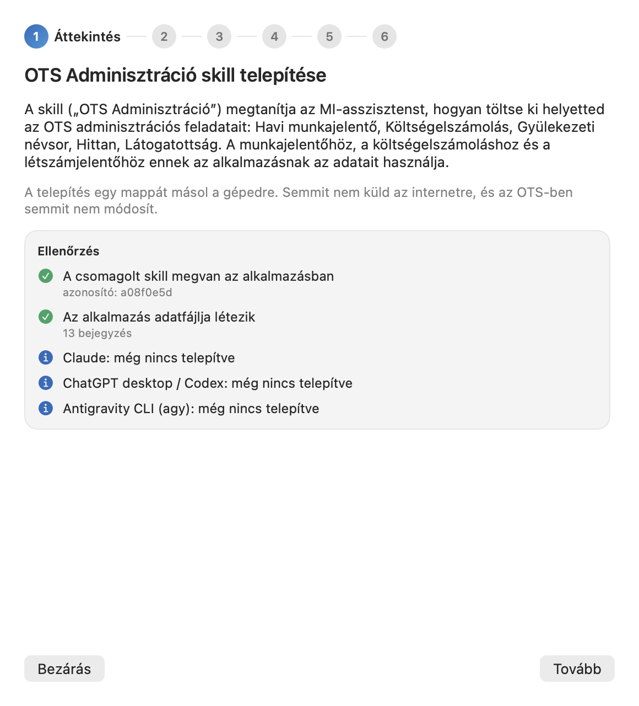

1. **Áttekintés:** ellenőrzi, hogy a csomagolt skill megvan, van adatfájl, és hogy melyik célra van már telepítve skill.
2. **Cél:** kiválasztod, hová telepítsünk: *Claude*, *ChatGPT desktop / Codex*, *Antigravity CLI (agy)* (többet is választhatsz). Az Antigravity CLI mellett zöld **„Ingyenes”** jelzés áll; a lépés megmutatja, telepítve van-e az `agy` a gépen, és ha nincs, kimásolható a telepítő parancs (`curl -fsSL https://antigravity.google/cli/install.sh | bash`). A skill az `~/.agents/skills` mappába kerül, ahonnan az `agy` betölti; a Codex is ezt a mappát olvassa, ezért ha mindkettőt kéred, egyszer másol. Ha korábban Gemini CLI-hez telepítettél skillt az alkalmazásból, a telepítő eltávolítja (előtte másolatot ment).
3. **Feladatok:** kiválasztod, mely feladatokat szeretnéd (Havi munkajelentő, Költségelszámolás, Gyülekezeti névsor, Hittan, Gyülekezeti látogatottság). A Határidők kiolvasása mindig része a skillnek.
4. **Adataid:** először megkérdezi, melyik OTS-oldalon dolgozol: **DETKapu** (https://ots.detkapu.hu) vagy **TETKapu** (https://ots.tetkapu.hu); a két oldal felépítése megegyezik, a skill a választott címet használja. Utána csak azt kéri, amit a kijelölt feladatok használnak. Mindig a neved; a Költségelszámoláshoz a **székhelyed**; a névsor, a Hittan és a Látogatottság feladathoz a **gyülekezeteid** (vesszővel elválasztva, a feladatok sorrendjében).
5. **Telepítés:** összegzés, majd a **Telepítés** gomb. Ha már van ilyen nevű skill, a telepítő lecseréli, de előtte **másolatot ment** (`~/Library/Application Support/OTS Munkajelentő Tracker/skill-mentesek`).
6. **Kész:** a következő lépések listája, a célnak megfelelő indítóparanccsal.

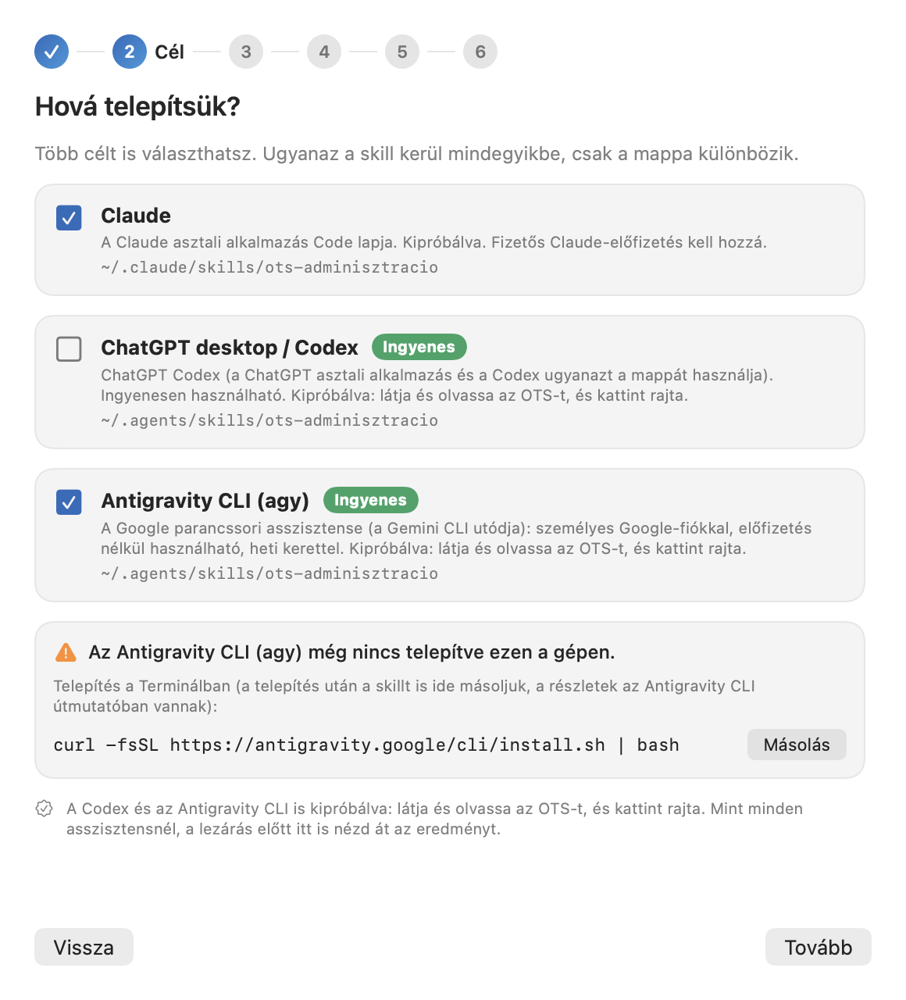
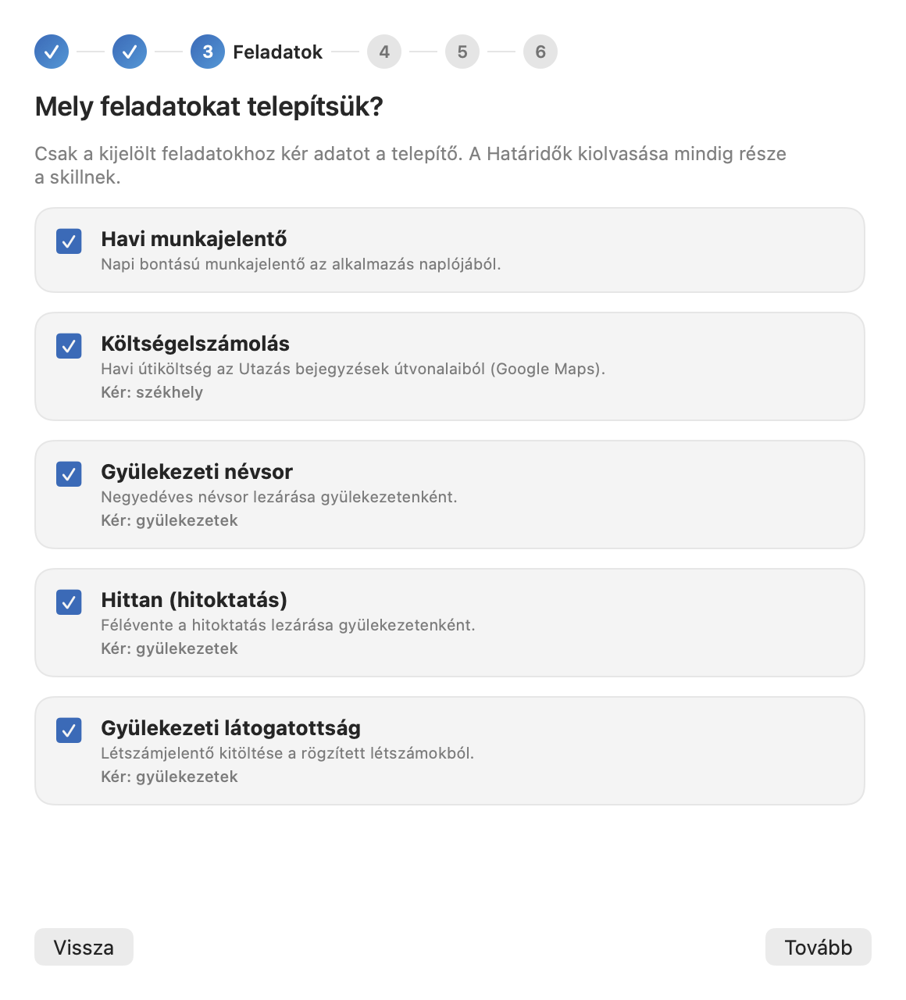
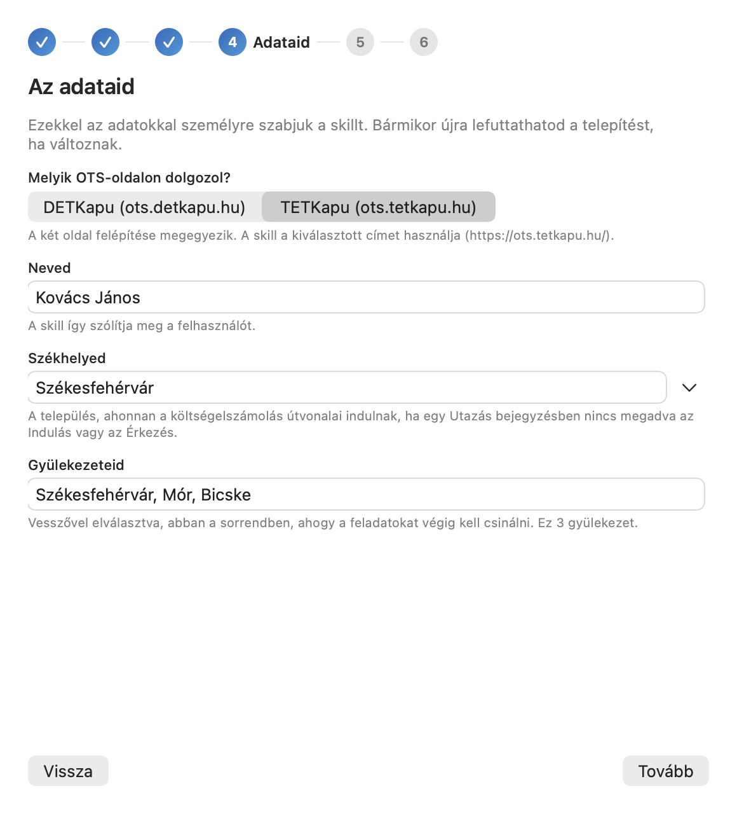

**Használat a telepítés után:**

1. Indítsd újra az asszisztens alkalmazását, hogy betöltse a skillt.
2. Nyiss új munkamenetet. Claude-ban a **Code** lapon írd be: `/ots-adminisztracio`. Codexben `$ots-adminisztracio`, a ChatGPT-ben `@` jellel is kiválasztható, az Antigravity CLI-ben (Terminál: `agy`) kapcsold be a `/browser` parancsot, és kérd: „Használd az ots-adminisztracio skillt”. Az első böngészőhívásnál több engedélyt is kér (olvasd el őket), és megnyílik egy Chrome-ablak: jelentkezz be benne te az OTS-be.
3. Az asszisztens megnyitja az OTS-t, kéri a bejelentkezést, és kilistázza az esedékes határidőket.
4. Válaszd ki, melyik feladattal kezdjétek. Az asszisztens **minden lezárás előtt megerősítést kér**, és a Havi munkajelentő kitöltése után megáll, hogy átnézhesd.

**Az ingyenes út röviden: Antigravity CLI lépésről lépésre** (a részletes változat a külön *Antigravity CLI útmutatóban* van):

1. **Telepítés** a Terminálban: `curl -fsSL https://antigravity.google/cli/install.sh | bash`. A parancs letölti a Google hivatalos programját (ellenőrző összeggel), és az `agy` parancsot a `~/.local/bin` mappába teszi. Nyiss új Terminál-ablakot, és ellenőrizd: `agy --version`.
2. **Első indítás:** írd be: `agy`. Válaszd ki a megjelenést, a böngészőben jelentkezz be a Google-fiókoddal. Node.js nem kell.
3. **A skill telepítése** az alkalmazásból (*Beállítások › Skill telepítése…*, cél: *Antigravity CLI*, „Ingyenes” jelzéssel). Ellenőrzés: az `agy`-ban kérd, hogy „Sorold fel a skilleket név szerint”, és látnod kell az `ots-adminisztracio`-t.
4. **Indítás:** a Terminálban `agy -i "Használd az ots-adminisztracio skillt. Kapcsold be a böngészőt (/browser), nyisd meg az OTS-t, és csak listázd a Határidők oldalon lévő feladatokat. Semmit ne zárj le és ne módosíts."`
5. **Engedélyek:** az első böngészőhívásnál több engedélyt is kér. Olvasd el mindet, és csak az OTS megnyitásához és olvasásához szükségeset engedélyezd. A `--dangerously-skip-permissions` kapcsolót ne használd.
6. **Bejelentkezés az OTS-be:** a megnyíló Chrome-ablakban te jelentkezz be, a jelszót ne add meg a Terminálban. Az asszisztens kiolvassa a Határidőket; ha nincs, azt jelzi.

Az Antigravity ingyenes csomagja **heti kerettel** működik; ha elfogy, várj a következő hétig, vagy használd a *Kézi felvitel az OTS-be* ablakot (14. fejezet).

**Szabályok, amiket a skill a naplódból követ:**

- A napi óraszámot a **típusonként összeadott** időből számolja, és **csak az összeget kerekíti fel egész órára**. A pomókat külön-külön nem kerekíti (4 pomo × 25 perc = 100 perc = 2 óra).
- Az alkalom és a fő is 1 órának számít a napi 8 órás összegben.
- A saját (egyedi) kategóriákat nem viszi át az OTS-be.
- Az üres napokra `!!!` jelölést tesz, amit neked kell kitöltened, mielőtt a hónap lezárható.
- A **Költségelszámolás** útvonalait az Utazás bejegyzések Indulás, Munkahely(ek) és Érkezés mezőiből állítja össze, és a Google Maps többpontos útvonalával számol. **Minden Utazás bejegyzés külön sorba kerül** (ha egy napra több van, bekapcsolja az OTS „Naponta több sor” pipáját). Ha a bejegyzésben megvan az **induló és az érkező km**, azt írja az Ind. km és az Érk. km mezőbe, és a Google Mapsre nincs szükség; ha csak az egyik van meg, a másikat a Google Maps adja; ha egyik sincs, a korábbi módon számol.
- A **Látogatottság** feladatnál a létszámokat a rögzített létszámjelentésekből olvassa. Ha egy dátumra és gyülekezetre nincs adat, rákérdez, és **soha nem talál ki számot**.

**Átnevezés (1.3.2):** a skill korábbi neve `detkapu-adminisztracio` volt. Ha az alkalmazás telepítette, az új telepítés lecseréli az új nevű skillre (a régiről másolat készül a `skill-mentesek` mappába). A kézzel telepített régi skillhez (például saját magadéhoz) nem nyúl, de jelzi, hogy van; ilyenkor érdemes az egyiket törölni, hogy ne legyen két hasonló skill.

**Frissítés:** az alkalmazás új verziója újabb skillt tartalmazhat. A telepítő első lépésében látod, ha „elérhető újabb változat” van; ilyenkor futtasd le újra a telepítést.

### Skill-frissítés (egy kattintással)

Ha az alkalmazás új változatában a skill is megváltozott (például újabb szabály az OTS kitöltéséhez), az alkalmazás **jelzi**, hogy a gépeden lévő skill régebbi:

- a fejlécben egy **narancssárga frissítés-ikon** jelenik meg (a fogaskerék mellett), és egy értesítés is érkezik (egyszer, változatonként);
- a **Beállítások › Skill** részben „Az alkalmazásban újabb skill van, mint a gépeden” sor és **Skill frissítése** gomb látszik.

A gombra (vagy az ikonra) kattintva a skill **a korábbi telepítés beállításaival** frissül: ugyanazok a célok (Claude, ChatGPT/Codex, Antigravity CLI), feladatok, a neved, a székhelyed, a gyülekezeteid és a DETKapu/TETKapu választás, nem kell újra végigmenned a varázslón. A régi skillről **másolat készül** (`~/Library/Application Support/OTS Munkajelentő Tracker/skill-mentesek`). A frissítés után **indítsd újra az asszisztens alkalmazását** (Claude, ChatGPT, Antigravity), hogy az új skillt töltse be.

A kézzel telepített skillt (nem a varázslóval) a frissítés nem bántja. Ha a korábbi beállítások nem elégségesek (például régi telepítésből), az alkalmazás ezt jelzi, és a **Skill telepítése…** varázslót kell használnod.

## 14. Kézi felvitel az OTS-be (skill nélkül)

Ha nem akarsz vagy nem tudsz a skillel dolgozni, az adatokat kézzel is felviheted az OTS-be. A főablak fejlécében a **táblázat ikon** (vagy *Beállítások › Skill › Kézi felvitel az OTS-be…*) külön ablakot nyit. Három adatkör közül választhatsz, és mindegyiket három nézetben látod:

- **Munkajelentő**, **Költségelszámolás**, **Létszámjelentő** (fent, a lapfülek);
- **Naptár** (grafikusan, a hónap napjaiban színes címkékkel), **Felsorolás** (naponként, kártyákon) és **OTS-táblázat** (az OTS Havi munkajelentő, Költségelszámolás és létszámjelentő oszlopai szerint, ugyanabban a sorrendben).

Fent a hónapot lapozhatod. Hónap elején (10-éig) az előző hónapnál nyílik meg, ha annak van adata, mert általában azt kell lezárni.

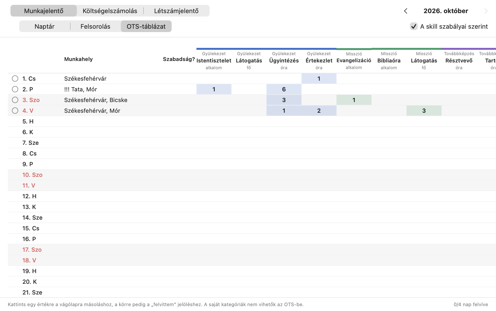

**Hogyan vidd fel?**
- Kattints egy értékre (szám, munkahely, útvonal, tevékenység): a **vágólapra másolódik**, és beillesztheted az OTS megfelelő mezőjébe. Az ablak alján látod, mi másolódott.
- A sor elején lévő **körre** kattintva megjelölheted, hogy a napot már felvitted (a jelölés eltűnik, ha később módosítod az adott nap adatait). Az ablak alján látod, hány nap van felvíve.
- A szám az OTS szabályai szerint van összesítve: naponta típusonként, az óra a napi összegből felfelé kerekítve (a Pomodoro-bejegyzések külön nem kerekítődnek), a fő és az alkalom darabszám, legfeljebb 8. A saját kategóriák nem szerepelnek az OTS-táblázatban.
- **Üres napok jelölése (!!!)** (Munkajelentő): bekapcsolva az ablak az üres napokat (hétköznap, szombat **és vasárnap** is) `!!!` jelöli, ahogy a skill is írná; a szabadnapot a Szabadnap bejegyzés jelöli (`SZABADNAP`). A sorokat a skill **nem egészíti ki 8 órára**: azt írja be, amit rögzítettél. Kikapcsolva (alapértelmezés) csak a rögzített napok szerepelnek.

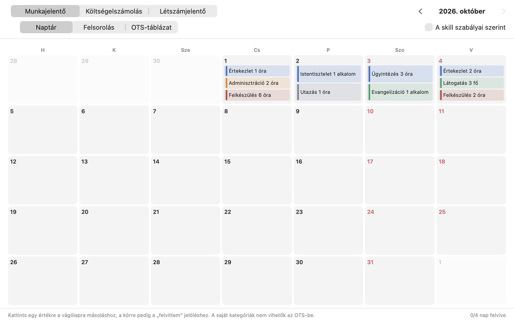

**Költségelszámolás:** **minden út külön sor** (ha egy napra több út van, a napon belüli sorszámmal, és az OTS-ben a „Naponta több sor” pipát kell bekapcsolni); soronként az útvonal (`Indulás - Munkahely1 - … - Érkezés`, az üres Indulás/Érkezés helyén a székhely, az egymás melletti azonos pontok összevonva) és a Tevékenység (kizárólag az Utazás bejegyzéseiből; oda-vissza útnál `A - B - A`). Ha az útnál **megvan a km-óra állása** (induló és érkező km), a sor a *Km-óra* oszlopban mutatja, és ezeket kell az OTS Ind. km és Érk. km mezőjébe írni. Ha nincs, a **Google Maps** gomb megnyitja a többpontos útvonalat, hogy a kilométert (autóval, a leggyorsabb út, felfelé kerekítve) kiszámold.

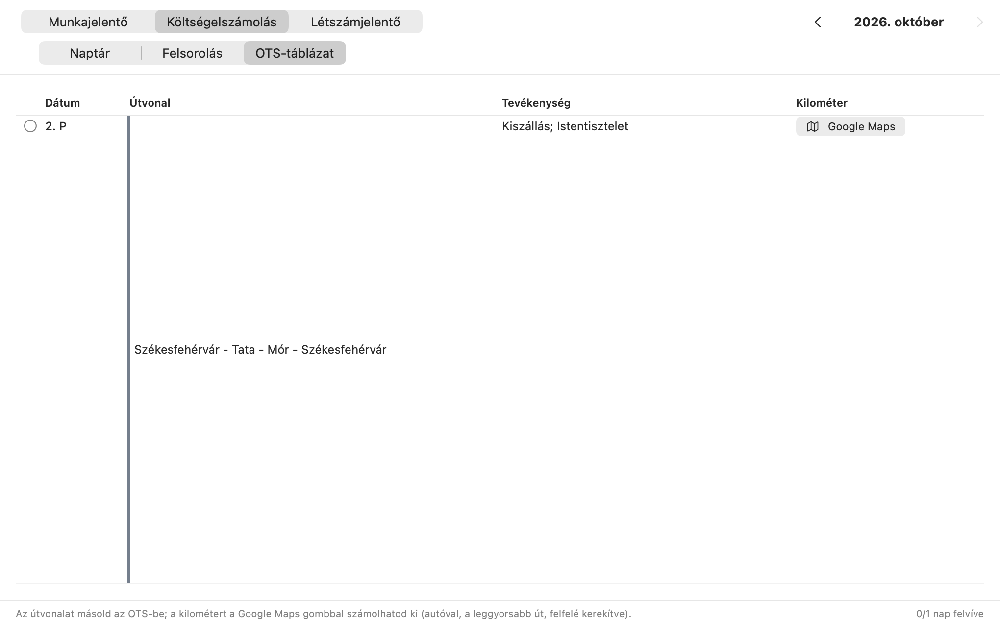

**Létszámjelentő:** az esedékes szombatok gyülekezetenként, Szombatiskola és Istentisztelet szerint (gyermek, felnőtt adventista, felnőtt vendég). A hiányzó jelentés narancs jelzést kap.

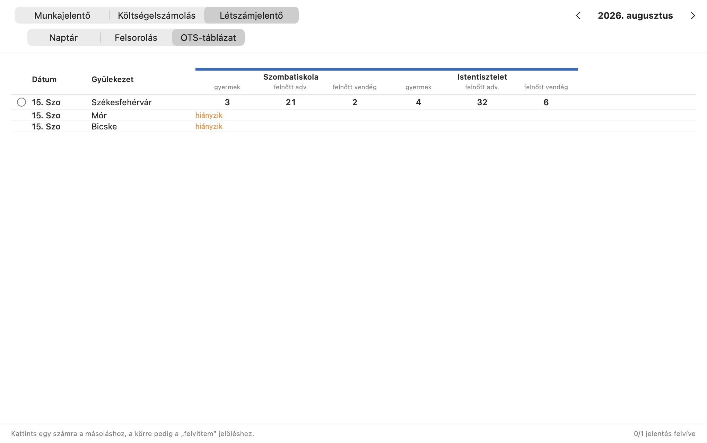

**Kategóriák színei:** a *Beállítások › Tevékenység-kategóriák › Kategóriák színei* alatt kattints egy kategória sorára: alatta kinyílik a színválasztó. Választhatsz a 16 kész színminta közül, vagy az **Egyedi** mezőbe beírhatsz egy `#RRGGBB` színkódot (Enter vagy **Beállít**). A kiválasztott színt vastagabb keret jelzi; az „Alapérték” gomb visszaállítja az eredeti színt. (A színválasztó az alkalmazásba van beépítve, nem a rendszer színpaneljét használja.) A szín megjelenik a naptárban, a napi lista soraiban (és az összesítő sor végén színes pontokként), valamint a kézi felviteli ablakban.

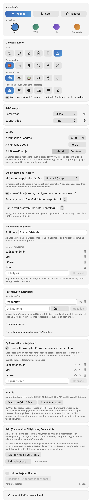

## 15. Naptárintegráció (Mac Naptár → alkalmazás)

### 15.1. Mire jó?

Ha a naptáradba (a telefonodon vagy a gépeden) beírod, mit csináltál, az alkalmazás **bejegyzésként átveszi**, és nem kell kétszer felvinned. A hozzáférés **egy irányú**: az alkalmazás csak olvassa a naptárat, a naptárba soha nem ír. Külön telefonos alkalmazás nincs: a telefonon a naptárba írsz, a Mac átveszi.

### 15.2. Beállítás

1. **A naptárad legyen a Mac Naptár-alkalmazásában.** A Google és az Outlook naptárad is megjelenik ott, ha a Mac szinkronizálja (*Rendszerbeállítások › Internetes fiókok*, fiók hozzáadása, majd a „Naptárak” bejelölése). Így egyetlen engedéllyel minden naptárad elérhető.
2. **Ajánlott: külön naptár** „OTS Munkajelentő” néven. Így a személyes eseményeid sosem kerülnek be.
3. Nyisd meg a **Beállítások › Naptár-szinkron** kártyát, kapcsold be, és engedélyezd a hozzáférést (a rendszer egyszer rákérdez; ha letiltottad, a *Rendszerbeállítások › Adatvédelem és biztonság › Naptárak* részben engedélyezheted újra, **teljes hozzáféréssel**).
4. Jelöld be, melyik naptárból olvasson, és állítsd be a visszamenőleg követett időszakot (alapból 60 nap). Az ennél régebbi bejegyzésekhez a szinkron nem nyúl.

A szinkron induláskor, a naptár megváltozásakor, az ablak előtérbe kerülésekor és a **Szinkron most** gombra fut. Csak a **már lezajlott** eseményeket veszi át (a jövőbelit és a ma még nem lejárt eseményt nem), a visszautasított és a törölt eseményt kihagyja.

### 15.3. A naptáresemény jelölése

Egy esemény = egy bejegyzés. A **cím** így néz ki: `Típus: Mit csináltál`. A **Helyszín** mező a munkahely. Az **időpont** a kezdés és a vég. A típus kisbetű- és ékezetfüggetlen; a kettőspont helyett ` - ` is jó. A Tevékenység csak az Utazásnál kötelező.

| Típus | Ezt írd a cím elejére (bármelyik) | Mérték |
|---|---|---|
| Istentisztelet | `Istentisztelet` | alkalom |
| Látogatás (gyülekezet) | `Látogatás` | fő |
| Látogatás (misszió) | `Missziós látogatás` | fő |
| Ügyintézés | `Ügyintézés`, `Ügy` | óra |
| Értekezlet | `Értekezlet`, `Ért` | óra |
| Evangelizáció | `Evangelizáció`, `Evang` | alkalom |
| Bibliaóra | `Bibliaóra`, `Bibl` | alkalom |
| Továbbképzés – résztvevő | `Továbbképzés`, `Képzés` | óra |
| Továbbképzés – tartott | `Tartott képzés`, `Tartott továbbképzés` | óra |
| Adminisztráció | `Adminisztráció`, `Admin` | óra |
| Felkészülés | `Felkészülés`, `Felk` | óra |
| Utazás | `Utazás`, `Utaz` | óra |
| Szabadság, Szabadnap, Munkaszüneti nap | `Szabadság`, `Szabadnap`, `Munkaszüneti nap` (vagy `Munkaszüneti`) | egész nap |

- **Munkahely:** a Helyszín mező (település vagy teljes cím), vagy gyorsan a címben: `Értekezlet @Győr: Heti megbeszélés` (a `@` erősebb a Helyszínnél). Munkahely nélkül az esemény az „Átnézésre vár” listára kerül (az egész napos típusoknál nem kell).
- **Mennyiség** (alkalom és fő típusoknál): `×3`, `x3`, `3 fő` vagy `3 alkalom`; nincs megadva: 1.
- **Utazás:** `Utazás: Győr → Tata, Mór → Győr | Kiszállás`, vagy oda-vissza: `Utazás: Győr ⇄ Tata, Mór | Kiszállás` (az Érkezés az Indulás). A `→` helyett `->`, a `⇄` helyett `<->` vagy `oda-vissza` is jó. A cél (Tevékenység) a `|` után áll, vagy az esemény Leírás mezőjének első sora; **Utazásnál kötelező**. Útvonal nélkül az Indulás és az Érkezés a székhely.
- **Egész napos események:** csak Szabadság, Szabadnap és Munkaszüneti nap. A többnapos esemény naponta egy bejegyzést ad, a mai napnál korábbi napokra.
- **Éjfélen átnyúló esemény** két bejegyzésre bomlik: az első a kezdés napján 24:00-ig, a második a következő napon 0:00-tól tart, mindkét nap a saját óraszámát kapja. (Alkalom és fő típusnál nem bomlik, mert a mennyiség nem duplázódhat.)

| Naptáresemény | Értelmezés |
|---|---|
| `Értekezlet: Heti munkatársi megbeszélés`, 9:00–10:30, helyszín: Győr | Értekezlet, 1:30 óra, Győr |
| `Felkészülés @Mór: Prédikáció`, 11:00–13:00 | Felkészülés, 2 óra, Mór |
| `Látogatás ×3: Idősek otthona`, helyszín: Mór | Látogatás, 3 fő, Mór |
| `Istentisztelet`, 10:00–12:00, helyszín: Tata | Istentisztelet, 1 alkalom, Tata |
| `Utazás: Győr ⇄ Tata, Mór \| Kiszállás`, 7:30–8:15 | Utazás, 0:45, Győr–Tata–Mór–Győr, cél: Kiszállás |
| `Szabadság` (egész napos, 3 napos) | 3 nap Szabadság |

A beállításokban a **Jelölések…** gomb ugyanezt a leírást megnyitja az alkalmazásban.

### 15.4. Pontos cím a Helyszínben

A Helyszín lehet település (`Győr`) vagy teljes cím (`Fő utca 3., Győr`).

- A **település** a cím utolsó vessző utáni része (az irányítószám és a „Magyarország” nélkül; ha az utolsó rész házszámos, a megelőző rész). Ez lesz a **Munkahely**, a teljes cím pedig a **Cím** oszlopba kerül.
- **Több címet kötelezően ` - `-vel** (szóköz-kötőjel-szóköz) kell elválasztani: `Fő utca 3., Győr - Mór u. 5., Mór` két külön cím. A címen belüli kötőjel (`Győr-Moson`, `Szent-Györgyi u.`) nem választ el; a telefon automatikus „–” és „—” jelét is elfogadja.
- **Utazásnál** a címek a Munkahelyek sorrendjét adják. Más típusnál csak egy cím adható: több cím esetén az első a Munkahely, az esemény pedig az „Átnézésre vár” listára kerül.
- A **Google Mapsben** a pontos cím szerepel az útvonalban. Az alkalmazás előbb ellenőrzi a címet az Apple beépített térképszolgáltatásával; ha nem találja, a település kerül az útvonalba. (Az Apple és a Google adatai eltérhetnek: előfordulhat, hogy a Google megtalálna egy címet, amit az Apple nem. Hálózati hiba esetén a pontos cím marad.) Az OTS Költségelszámolásába továbbra is a települések kerülnek.

### 15.5. A naptár a mérvadó (módosítás és törlés)

Az alkalmazás **követi a naptárat**: a naptárban utólag módosított esemény bejegyzése frissül, a naptárban törölt (vagy lemondott, visszautasított) esemény bejegyzése az alkalmazásból is törlődik. **A kézzel felvitt bejegyzéshez a szinkron soha nem nyúl.** Ha egy naptárból átvett bejegyzést kézzel módosítottál, a következő szinkron a naptár adataival felülírja; ha ezt nem szeretnéd, javítsd az eseményt a naptárban.

Védelem: minden módosítás előtt másolat készül (`bejegyzesek.naptar-elotti.csv`). Ha a szinkron **hirtelen sok bejegyzést** törölne (több mint 5-öt, és az ablakban lévő naptáras bejegyzések felénél többet), vagy a naptár üresnek látszik (például szinkronhiba miatt), **nem töröl magától**: a kártyán rákérdez. A **Törlöm őket** végrehajtja, a **Megtartom** kézi bejegyzéssé teszi őket (a szinkron többé nem követi), a **Később** elhalasztja. A naptár kijelölésének megszüntetése nem töröl bejegyzést.

### 15.6. Átnézésre vár: Hiányos és Nem felismert események

Amit az alkalmazás nem vehet át magától, az a **Beállítások › Naptár-szinkron › Átnézésre vár** ablakban jelenik meg:

- **Hiányos:** a típus felismerhető, de valami hiányzik (munkahely, az Utazás célja, több cím a Helyszínben, stb.). Írd be a hiányzót, és kattints az **Átvétel** gombra.
- **Nem felismert:** a cím nem ismert típussal kezdődik (például „Fogorvos”). Válassz típust: ez **egyszeri döntés** ennél az eseménynél, szabály nem keletkezik. A saját kategóriák nem választhatók, azok nem kerülnek az OTS-be.
- **Kihagyom:** az esemény véglegesen kikerül a listáról.

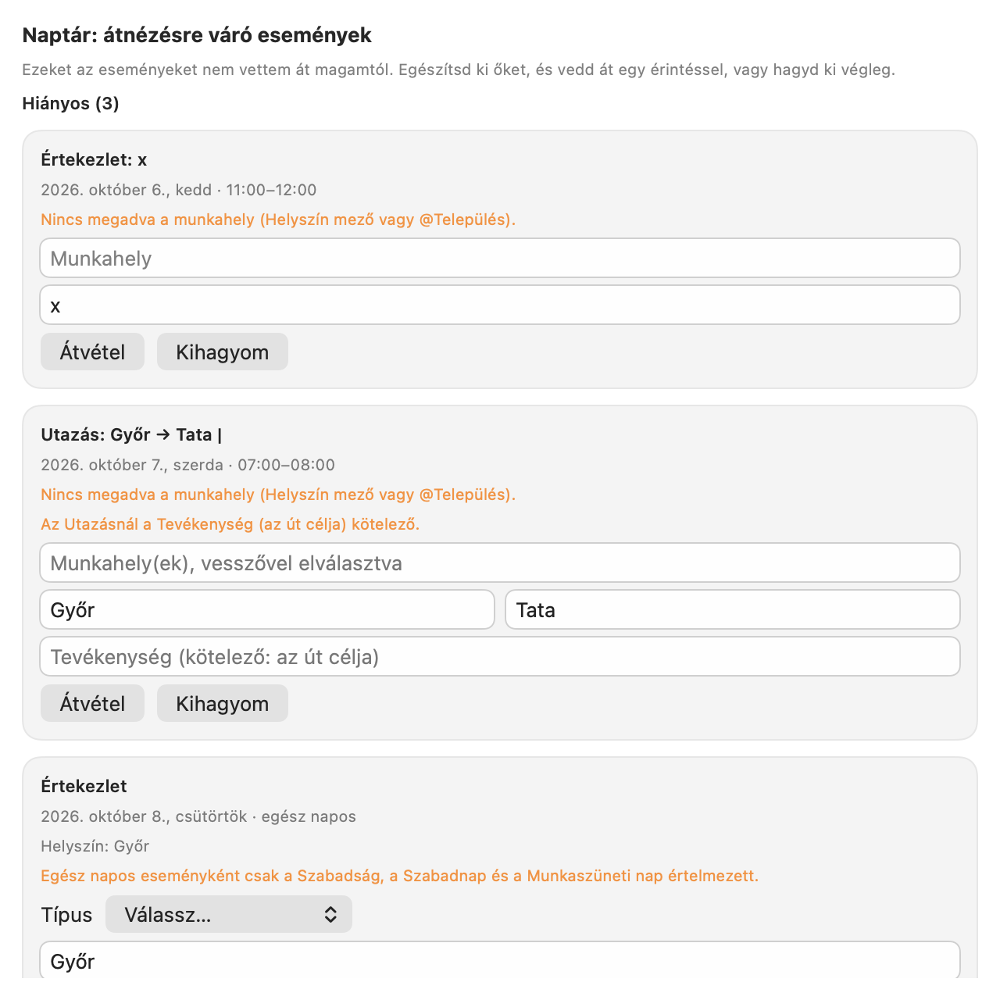

A nulla vagy negatív időtartamú vagy 31 napnál hosszabb eseményt itt nem lehet átvenni: javítsd a naptárban, vagy hagyd ki. Az átvett bejegyzés többé nem kerül a listára, és a szinkron nem írja felül.

### 15.7. Pontos cím a kézi felvitelben (Utazás)

Az Utazás **Kiindulás** és **Cél** mezőjébe település (`Tata`) vagy település és pontos cím is írható (`Tata, Fő út 1.`: a település elöl, vesszővel). A Célba több hely is írható, mindegyik külön lehet egyszerű vagy pontos (`Tata, Fő út 1., Mór`). Külön jelölőnégyzet nincs. Részletek: az 5. fejezet „Utazás” pontja.

- A cím a bejegyzés **Indulás cím** és **Cím** (a Cél helyeié) mezőjébe kerül, az OTS-be továbbra is a település megy.
- A **Költségelszámolás Google Maps** gombja a pontos címet használja (előbb ellenőrzi az Apple szolgáltatásával; ha nem találja, a település kerül a hivatkozásba, lásd 15.4).
- Oda-vissza útnál a visszaút a Kiindulás pontos címére megy.
- A cím formája `Település, utca házszám`. A fordított `Fő út 1., Tata` és az irányítószám (`9021 Győr`) is érthető. Hibás forma esetén a rögzítés gomb alatt jelzi az alkalmazás.

## 16. Hibaelhárítás

| Mi történik | Mit tegyél |
|---|---|
| Nem találom az ikont a menüsorban. | Ellenőrizd, hogy fut-e (Tevékenységfigyelő). A menüsor szűk helyén a Mac elrejthet ikonokat; nyiss meg egy másik alkalmazást, vagy zárj be néhány menüsori ikont. |
| Nem ad menüt a jobb kattintás. | Próbáld Ctrl + kattintással. |
| Nem tudok kilépni. | Jobb kattintás az ikonon › **Kilépés**, vagy a Beállítások alján a **Kilépés** gomb. |
| Nem indítható el a Start / Pomo gomb. | Hiányzik a Munkahely vagy a Típus (Utazásnál az Indulás, az Érkezés és a Tevékenység is; a Tevékenység máshol nem kötelező). A gomb alatt a hiányzó mezőt jelzi az alkalmazás. |
| Nem tudok jövőbeli napra felvinni. | Szándékos: csak a mai napig lehet bejegyzést vagy létszámjelentést rögzíteni. |
| A naptárban nem látom a reggeli bejegyzést. | A naptár csak a Beállításokban megadott munkanapot mutatja. Állítsd korábbra a kezdő órát; a nap tetején a ↕ jel mutatja, ha van kilógó bejegyzés. |
| Nincs ott a létszámjelentő kártya. | Kapcsold be a Beállításokban, és regisztrálj legalább egy gyülekezetet. A kártya csak esedékes szombaton (vagy lemaradásnál) jelenik meg. |
| „This client is no longer supported for Gemini Code Assist” hiba. | Ez a megszűnt Gemini CLI üzenete. Használd az Antigravity CLI-t (lásd a 13. fejezetet és az Antigravity CLI útmutatót). |
| Az asszisztens nem ismeri fel a skillt. | Indítsd újra az asszisztens alkalmazását, és ellenőrizd, hogy a telepítés mappájában (például `~/.claude/skills/ots-adminisztracio`) van `SKILL.md`. Futtasd újra a telepítőt. |
| Az asszisztens nem talál adatot a hónapra. | Nyisd meg az alkalmazást, ellenőrizd, hogy a Beállítások › Adatfájl a megfelelő mappát mutatja, és hogy a hónapra van bejegyzés. |
| A kategória színére kattintva nem történik semmi. | Az 1.3.1-ben a rendszer színpaneljét használtuk, ami a menüsori ablakból nem nyílt meg. Az 1.3.2-től a színválasztó beépített: kattints a kategória sorára, és válassz a színminták közül. Ha még a régi verziót látod, lépj ki belőle (jobb kattintás az ikonra › Kilépés), és indítsd az újat. |
| A Beállításokban azt írja: „Az engedély megtagadva”, vagy a naptárak listája üres. | Nyisd meg a *Rendszerbeállítások › Adatvédelem és biztonság › Naptárak* oldalt, és engedélyezd a **teljes hozzáférést** az alkalmazásnak. Utána a Beállításokban a kártya magától frissül (ha nem, kapcsold ki és be a szinkront). |
| A Google/Outlook naptáram nincs a listában. | Add hozzá a fiókot a Mac-en: *Rendszerbeállítások › Internetes fiókok*, és jelöld be a „Naptárak” opciót. Nyisd meg egyszer a Mac Naptár-alkalmazást, hogy letöltse az eseményeket. |
| A naptáresemény nem kerül be. | Csak a lezajlott, nem visszautasított eseményt veszi át, a kiválasztott naptárból, a követett időszakon belül, ismert típusnévvel kezdődő címmel. Nézd meg az „Átnézésre vár” ablakot és a Jelölések leírást. |
| Egy átvett bejegyzés eltűnt vagy megváltozott. | A naptár a mérvadó: valószínűleg törölték vagy módosították az eseményt a naptárban. A szinkron előtti állapot a `bejegyzesek.naptar-elotti.csv` fájlban van. |
| A Google Maps nem a pontos címet mutatja. | Az alkalmazás előbb ellenőrzi a címet az Apple szolgáltatásával; ha ott nem található (elírás, rövidítés), a település kerül az útvonalba. Írd a címet teljesebben (`Fő utca 3., 9021 Győr`), vagy javítsd a bejegyzés Cím oszlopát. |
| Az alkalmazás leállt. | Nyisd meg újra; a futó időzítő folytatódik. A leállási jelentés a `~/Library/Logs/DiagnosticReports` mappában van; küldd el a fejlesztőnek. |
| Az adatfájl hibás sort jelez. | Nyisd meg táblázatkezelőben, javítsd a jelzett sort. Az eredeti fájl másolata megmarad. |

## 17. Változásnapló

Az alkalmazás összes eddigi változása, verziónként (a legújabb van legfelül). Ha régebbi verziót használsz, a frissítés a zip kicsomagolásával és az Alkalmazások mappába húzással megy (előbb lépj ki a futó példányból); az adataid és a beállításaid megmaradnak.

### 1.6.2
- **Licenc:** a forráskód MIT licenc alatt áll (az Adventista jelkép az egyház védjegye, nem része a licencnek).
- A skill Költségelszámolás-leírásában a példa autó-fül neve általános példa lett. Emiatt a telepített skillnél megjelenhet a frissítés-jelzés: kattints rá, és a skill frissül (a régiről másolat készül).

### 1.6.1
- **Javítás: a javaslatlista a Munkahely, a Kiindulás és a Cél mezőben** többé nem kerül az alatta lévő mezők szövege mögé, és a javaslatra kattintva a mező megkapja a javaslatot (korábban a lista eltűnt, a mező pedig üresen maradt).

### 1.6.0
- **Kilométeróra az Utazásnál:** az űrlapon mindig látszik az **induló és az érkező km** mező (nem kötelezők). Az induló km az előző út végállásával előtöltődik. Hibás értéknél (az érkező nem nagyobb az induló km-nél, az induló kisebb az előző út végállásánál, nem szám) az űrlap jelzi, és nem engedi a rögzítést.
- **Km-javítás:** a napi listában az Utazás sorokon ceruza ikon: a rögzített út km-állásai utólag javíthatók vagy törölhetők.
- **A hónap összes km-e** az ablak alján, ha a *Beállítások › Rögzítés › Kilométeróra* kapcsoló be van kapcsolva.
- **Költségelszámolás: minden út külön sor** a Kézi felvitel ablakban, a km-órás állásokkal együtt (a Google Maps gomb csak ott marad, ahol nincs teljes km-állás). Ha egy napra több út van, az OTS-ben a „Naponta több sor” pipa szükséges.
- **CSV:** két új, opcionális oszlop a fájl végén: `Induló km`, `Érkező km` (a régi fájlok olvashatók maradnak).
- **Skill:** minden Utazás külön OTS-sor (több út egy napon: „Naponta több sor”); az Ind. km és az Érk. km a trackerből jön, ha megvan (egyébként a Google Maps).

### 1.5.6
- **Hétvége:** az üres szombat és az üres vasárnap is jelez (piros pont a naptárban és a napi listában, szerepel a kitöltetlen napok között). Hétvégén nincs napi óraszám, bármilyen bejegyzés elég.
- **Szabadnap egy kattintással:** a kitöltetlen napok címkéjén hold ikon és jobb kattintásos menü, a címsorban **Vasárnapok → szabadnap (N)** gomb.
- **Figyelmeztetés a havi korlátra:** ha a Szabadnap vagy a Munkaszüneti nap száma meghaladná a hónap heteinek számát, az alkalmazás szól (az OTS ezt lezáráskor hibának veszi).
- **A skill már nem egészíti ki a sorokat 8 órára** (és a 4 órát meghaladó Ügyintézés `!!!` jelölése is megszűnt), a **vasárnap pedig nem magától szabadnap:** az üres vasárnap `!!!` kerül a sorba, a szabadnapot a Szabadnap bejegyzés jelöli. A Kézi felvitel kapcsolója ennek megfelelően **Üres napok jelölése (!!!)** lett.

### 1.5.5
- **Javítás: a Tevékenység típusa mezőben a javaslat elfogadása után (Enter, Tab vagy kattintás) eltűnt a szöveg.** Most elfogadás után a mező elengedi a fókuszt, és a kiválasztott típus neve látszik; gépelés közben (fókuszban, üresen) a kiválasztott típus halványan látszik, és ha a keresést félbehagyva kilépsz a mezőből, újra a kiválasztott típus látszik.

### 1.5.4
- **Beállítások fülekre osztva:** Megjelenés, Rögzítés, Naptár, OTS, Adatok (a fülsor az app többi fülével egyező stílusú, az utolsó fül megmarad).
- **Újranyitáskor a rögzítő oldal:** ha a menüsori ablakot bezárod a Beállításokban (ikonra vagy kívülre kattintva), újranyitáskor a rögzítő oldal jön. A leválasztott ablakra ez nem vonatkozik.
- **Javaslatok gépelés közben:** Munkahely, Kiindulás, Cél (az éppen írt helyre), Tevékenység típusa (gépelve szűr, a nyíl a teljes listát nyitja) és Tevékenység (a korábbi tevékenységekből); ékezet- és kisbetű-független. ↓/↑, Enter, Tab, Esc és kattintás. Beállítások › Rögzítés alatt kikapcsolható.

### 1.5.3
- **A menüsori számláló javítása (az 1.5.2 hibája).** Az 1.5.2-ben a számláló egyáltalán nem látszott a menüsorban (csak az ikon): a menüsori elem a címkében csak egy képet fogad el, a második képet eldobta. Most, amikor idő látszik, az ikon és az idő **egyetlen képként** jelenik meg, szélességazonos számjegyekkel. Ezt a futó alkalmazás menüsori elemén mértük: a szélessége végig állandó (korábban 73 és 76 pont között ugrált); csak egy óra után változik egyszer (a `h:mm:ss` alak hosszabb).

### 1.5.2
- **A menüsori számláló nem ugrál (javítás).** Az 1.5.1 után a számok még mozogtak, mert a menüsori elem a szöveget a saját, arányos számjegyű betűtípusával rajzolta újra. Most az időt az alkalmazás maga rajzolja ki egy képre (szélességazonos számjegyekkel, rögzített szélességgel), így minden számjegy ugyanazon a helyen áll.

### 1.5.1
- **A menüsori számláló nem ugrál:** az időzítő és a Pomodoro ideje állandó szélességű, szélességazonos számjegyekkel jelenik meg, így másodpercenként sem mozog a menüsori ikon.

### 1.5.0
- **Skill-frissítés egy kattintással.** Ha az alkalmazásban újabb a skill, mint a gépeden telepített, az alkalmazás jelzi (fejléc-ikon, értesítés, Beállítások › Skill), és egy kattintással frissíti a korábbi telepítés beállításaival (másolat a régiről).
- **Időzítő: korábbi kezdés.** Indítás előtt megadható a Kezdés ideje (óó:pp, vagy −5/−10/−15/−30 perc gombok), futás közben is javítható; az idő onnantól számolódik (legfeljebb a nap elejéig, jövőbeli nem lehet).
- **Az Utazás űrlap újratervezve.** Nincs külön Munkahely(ek) mező: **Kiindulás** és **Cél**. A Célba több hely is írható, pontos címmel is (`Tata, Fő út 1., Mór`); a Kiindulásba egy hely (`Győr, Fő út 1.`).
- **„Munkahely” választógomb** a Kiindulás és a Cél fölött: azt jelöli, melyik volt a munkahely (alapból a Cél). Új, opcionális CSV-oszlop: `Munkahely helye` (`indulás`, ha a Kiindulás volt).
- **Oda-vissza pipa** a két mező mellett, **alapból bejelölt**: `Kiindulás - Cél(ek) - Kiindulás`. Kikapcsolva egyirányú út: `Kiindulás - Cél(ek)`. Minden rögzítés után újra bejelölt.
- A CSV-ben az Indulás, a Munkahely (a Cél helyei) és az Érkezés oszlop jelentése változatlan, így a skill és a régi fájlok tovább működnek.

### 1.4.1
- **Utazás: pontos cím az Indulás és az Érkezés mezőben.** Település (`Tata`) vagy település és cím (`Tata, Fő út 1.`) is írható, mindkét mezőnél külön döntheted el, hogy van-e pontos címe. A „Teljes címet adok meg” jelölőnégyzet megszűnt (kézi felvitelnél most csak az Utazásnál van pontos cím; a naptárból átvett bejegyzésé a `Cím` oszlopban továbbra is). Az OTS-be a település megy, a pontos címet a Google Maps használja. Új CSV-oszlopok: `Indulás cím`, `Érkezés cím`.
- **Oda-vissza pipa:** az Érkezés mező mindig írható. Nincs bejelölve: `Indulás - Munkahely(ek) - Érkezés`. Bejelölve az útvonal végére az Indulás is kerül: `Indulás - Munkahely(ek) - Érkezés - Indulás`. Üres (vagy az Indulással egyező) Érkezésnél a régi `Indulás - Munkahely(ek) - Indulás` marad. A CSV-ben ilyenkor az Érkezés oszlop az Indulás, a beírt Érkezés utolsó Munkahelyként szerepel, így a skill változtatás nélkül a helyes útvonalat kapja.

### 1.4.0
- **Naptárintegráció (egy irányú: naptár → alkalmazás):** a Mac Naptár-alkalmazásának lezajlott eseményeit (iCloud, Google, Outlook – amit a Mac szinkronizál) átveszi bejegyzésként. Beállítások › Naptár-szinkron: engedély, naptárválasztó, követett időszak, „Szinkron most”. Részletek a 15. fejezetben.
- **Jelölési szabály:** `Típus: Mit csináltál` a címben, a Helyszín a munkahely; `@Település`, `×3`, Utazás útvonallal (`→`, `⇄`), egész napos Szabadság/Szabadnap/Munkaszüneti nap. A Jelölések leírás az alkalmazásban is megnyitható.
- **A naptár a mérvadó:** a módosított esemény bejegyzése frissül, a törölt esemény bejegyzése törlődik (kézi bejegyzéshez nem nyúl). Másolat készül minden módosítás előtt; sok törlés egyszerre csak megerősítéssel hajtódik végre.
- **Átnézésre vár ablak:** a hiányos és a nem felismert események egy érintéssel kiegészíthetők és átvehetők, vagy véglegesen kihagyhatók.
- **Éjfélen átnyúló esemény** két napra bomlik (alkalom és fő típusnál nem).
- **Pontos címek:** új `Cím` és `Naptár azonosító` oszlop a CSV-ben (a régi fájlok olvashatók maradnak); „Teljes címet adok meg” jelölőnégyzet a kézi felvitelben (az 1.4.1-ben az Indulás és az Érkezés mezők váltották fel); a naptári Helyszínben több cím ` - ` elválasztóval; a Google Maps útvonalban a pontos cím szerepel (Apple térképes ellenőrzéssel, tartaléknak a település).
- **macOS 14 vagy újabb szükséges.** Az alkalmazás kéri a Naptár-hozzáférést (csak olvasás).

### 1.3.3
- **Antigravity CLI a Gemini CLI helyett, „Ingyenes” jelzéssel.** A Google 2026. június 18-tól leállította a Gemini CLI-t magánszemélyeknek (a bejelentkezéskor „This client is no longer supported” hibát ad), az utódja az Antigravity CLI (`agy`), amely személyes Google-fiókkal ingyenes (heti kerettel). A telepítő Cél lépése most az Antigravity CLI-t kínálja, jelzi, hogy az `agy` telepítve van-e, és megmutatja a telepítő parancsot.
- **A skill helye az Antigravity CLI-nél `~/.agents/skills`** (a Codex közös mappája). A dokumentációban megadott `~/.gemini/antigravity-cli/skills` mappából az `agy` nem töltötte be a skillt, ezt kipróbálva derítettük ki.
- A régi, az alkalmazás által a Gemini CLI-hez telepített skillmásolatot (`~/.gemini/skills`) a telepítő eltávolítja (másolatot ment); a Gemini böngészőágens-beállítás (`settings.json`) megszűnt, az Antigravity CLI-nél a böngészőt a `/browser` paranccsal kell bekapcsolni.
- **Új, részletes Antigravity CLI útmutató** (külön PDF és az alkalmazásban megnyitható). A Gemini CLI útmutató megszűnt.
- **Kipróbálva:** az Antigravity CLI és a ChatGPT Codex is látja és olvassa az OTS-t, és kattint rajta; mindkettő ingyenes. A telepítő mindkettőt „Ingyenes” jelzéssel mutatja.

### 1.3.2
- **A skill új neve: „OTS Adminisztráció”** (azonosító: `ots-adminisztracio`). A telepítő a régi `detkapu-adminisztracio` skillt, ha az alkalmazás telepítette, lecseréli (másolat mellett); a kézzel telepítettet nem bántja.
- **DETKapu vagy TETKapu:** a telepítő megkérdezi, melyik OTS-oldalon dolgozol (https://ots.detkapu.hu vagy https://ots.tetkapu.hu), és a skill megfelelő helyein a választott címet írja be.
- **Gemini CLI a telepítőben (az 1.3.3-ban az Antigravity CLI váltotta fel):** a telepítő a Gemini böngészőágensét is bekapcsolja (`~/.gemini/settings.json`, a meglévő beállítások megtartásával, másolattal, csak a választott OTS-oldalra korlátozva). A Gemini CLI útmutató az alkalmazásba is bekerült.
- **Oda-vissza út** (Utazás): bejelölve az Érkezés az Indulás (`Indulás - Munkahely(ek) - Indulás`), így az útvonal és a kilométer a teljes oda-vissza utat adja. A választás megmarad. (Az 1.4.1-től az Érkezés mező mindig írható, lásd ott.)
- **Költségelszámolás tevékenysége:** kizárólag az Utazás bejegyzések Tevékenységéből kerül a táblázatba (a kézi felviteli ablakban és a skillben is); más kategória tevékenységét nem veszi át.
- **A Tevékenység csak az Utazásnál kötelező**, minden más típusnál opcionális (referencia).
- **Naptár:** a napok neve és száma pontosan az oszlopuk fölött, középen áll; a rács szélessége gépfüggetlen (görgetősáv nélkül), a vasárnapi oszlop sem csonkul.
- **Átméretezhető leválasztott ablak:** szélességben és magasságban is húzható; a tartalom, a naptár rácsa és magassága követi.
- **Napi lista:** az összesítő sor végén a kategóriák színes pontjai nem csúsznak a szöveg fölé.
- **Javítás: a kategóriák színe újra állítható.** Az 1.3.1-ben a színre kattintva nem történt semmi, mert a rendszer színpaneljét a menüsori ablakból nem lehet megbízhatóan megnyitni. Most beépített színválasztó van: 16 színminta és egyedi `#RRGGBB` kód, „Alapérték” gombbal (lásd a 14. fejezetet).

### 1.3.1
- **Kézi felvitel az OTS-be** (fejléc táblázat ikon, vagy Beállítások › Skill): külön ablak, ha nem a skillel dolgozol. Három adatkör: **Munkajelentő**, **Költségelszámolás**, **Létszámjelentő**. Három nézet: **Naptár**, **Felsorolás**, **OTS-táblázat** (az OTS oszlopai szerint).
- Kattintásra az érték a vágólapra másolódik; „felvittem” jelölés naponként (a jelölés érvényét veszti, ha a nap adata változik); a felvitt napok száma az ablak alján.
- Munkajelentő: opcionális „A skill szabályai szerint” kapcsoló (hétköznap 8 órára kiegészítés az Ügyintézésben, `!!!` jelölés, üres napok).
- Költségelszámolás: naponta az útvonal és a Tevékenység, **Google Maps** gombbal a kilométer kiszámításához; több útvonal egy napon jelzéssel.
- Létszámjelentő: az esedékes szombatok gyülekezetenként, a hiányzó jelentés jelzésével.
- **Kategóriák színei** (Beállítások): a naptárban, a napi lista soraiban (és színes pontokként az összesítő sor végén), valamint a kézi felviteli ablakban jelennek meg.

### 1.3.0
- **Skill-telepítő:** több célra (Claude, ChatGPT/Codex és a későbbi verziókban az ingyenes Antigravity CLI), kiválasztható feladatokkal; csak a kijelölt feladatokhoz kér adatot (név, székhely, gyülekezetek); meglévő telepítés felülírása előtt másolat készül.
- **Utazás:** Indulás, Munkahely(ek) és Érkezés mezők; a Költségelszámolás ezekből számol Google Maps többpontos útvonalat, és már nem függ a Havi munkajelentőtől.
- **Gyülekezeti létszámjelentő:** negyedévenként a második és hetedik szombaton, gyülekezetenként; külön `letszamjelentesek.csv`; lemaradásnál jelzés a kitöltetlen napok között.
- **Naptár:** beállítható munkanap-sáv (a sávon kívüli bejegyzéseket ↕ jel mutatja) és a hét kezdőnapja (hétfő vagy vasárnap).
- **Jelzések:** a napi 8 óra piros pontja, hiányos napok, hosszú kihagyás után emlékeztető ikon és sáv; a szabadság, szabadnap és munkaszüneti nap kitöltöttnek számít.
- **Megjelenés:** alapból az Adventista jelkép a menüsorban; négy színséma (kék, zöld, lila, borostyán); világos, sötét és rendszer mód.
- **Változás a kollégáknak:** a helyszínlista új telepítésnél üres, és használat közben épül (korábban Győr, Tata, Tatabánya volt előre megadva).
- **Stabilitás:** védett dátumszámítás egységtesztekkel (2024–2035, több időzónában); az ablak mérete kisebb kijelzőn sem lépi túl a képernyőt (880 pontnál alacsonyabb látható magasságnál az ablak magától kompakt).

### 1.2.0
- **Claude Skill telepítése** a Beállításokból: a csomag tartalmazza a skillt, és egy varázsló telepíti (név, székhely, gyülekezetek megadásával; meglévő skill felülírása előtt másolat készül). Személyes adat nem kerül a csomagolt skillbe.
- **Használati útmutató** az alkalmazásban (HTML) és PDF-ben.
- A skill (Havi munkajelentő, Költségelszámolás) már nem külső időmérő szolgáltatásból, hanem kizárólag ennek az alkalmazásnak az adataiból dolgozik.

### 1.1.5
- A napi összesítőben 1 fő és 1 alkalom is 1 órának számít („Összesen: …”).
- A Pomodoro hátralévő ideje a menüsorban a Beállításokban kapcsolható.
- A skill a Pomodoro-bejegyzéseket napi és típusonkénti összegben kerekíti fel, nem külön-külön.

### 1.1.4
- A menüsori ikonra **jobb kattintásra** (vagy Ctrl + kattintásra) menü jelenik meg: ablak megnyitása, a futó időzítő vagy pomo leállítása/elvetése, leválasztott ablak, kompakt nézet, ikon választása, adatfájl megjelenítése, **Kilépés**.

### 1.1.3
- A menüsori ablak újra a tartalom magasságát veszi fel (az 1.1.2-ben vékony csíkká zsugorodott). A hosszú napi lista és a Beállítások saját, rögzített magasságú görgethető területet kapott, így az ablak nem nőhet magasabbra a képernyőnél. Alacsony képernyőn az ablak automatikusan kompakt.

### 1.1.2
- **Összeomlás-javítás:** az ablak magassága a képernyőnél nem nőhet nagyobbra; a leválasztott ablak rögzített méretű, kézzel átméretezhető.
- A lapfülek teljes területe kattintható.
- A hibás számok a CSV-ben nem okozhatnak leállást.
- A Beállításokban, két megerősítés után, az összes adat törölhető (alapállapot; a törlés előtti állapot másolata megmarad).

### 1.1.1
- Ha van leválasztott ablak, a menüikonra kattintás azt hozza előre (a lenyíló ablak nem nyílik meg mellette).

### 1.1.0
- Jövőbeli napra (és a mai nap jövőbeli idejére) nem lehet bejegyzést felvenni, sem kézzel, sem a naptárban.
- A napi lista mellett **Ma** gomb ugrik a mai napra.
- Rögzítés (vagy leállítás) után az űrlap kiürül.
- A helyszínek listája automatikusan épül, és a Beállításokban szerkeszthető. Saját tevékenység-kategóriák adhatók (az OTS-be nem kerülnek át), a beépített OTS-kategóriák elrejthetők.
- Leválasztható, mozgatható, kitűzhető ablak és kompakt nézet.
- Menüikon: Pomo közben paradicsom, szünetben csésze (mindhárom ikon cserélhető); a lejárt pomo és szünet hangja választható.

### 1.0.0
- Menüsori időmérő: **Időzítő**, **Kézi bevitel** (időponttal vagy óraszámmal), **Pomodoro** (25/5/15 perc, minden 4. pomo után hosszú szünet, módosítható; a félbehagyott pomo eltelt ideje is mentődik) és **Naptár** (heti nézet, húzással új bejegyzés).
- Mezők: Munkahely, Tevékenység típusa (az OTS Havi munkajelentő oszlopai), Tevékenység; a Látogatás mennyisége **fő**, az Istentiszteleté, Evangelizációé és Bibliaóráé **alkalom**; Szabadság, Szabadnap és Munkaszüneti nap választható.
- Az ablak alján a kiválasztott nap összes bejegyzése és a kitöltetlen napok (a vasárnapokat is beleértve).
- Az adatok `bejegyzesek.csv` fájlban (pontosvesszővel tagolt, Excelben is szerkeszthető), a gépen maradnak; az „OTS Adminisztráció” skill (`ots-adminisztracio`) innen olvassa őket.

---

*Ez az útmutató az alkalmazás {{VERZIO}} verziójához készült. Az OTS Munkajelentő Tracker saját fejlesztésű eszköz; nem hivatalos termék.*
